[TOC]


# function

## function fchkcbmk

验证是否进行抄表

## function f_get_hire_code

获取租用信息

## function f_get_sbid

用途： 取水表编号
备注：水表编号前面9位是从序号取，后面一位是前面9位数据相加，取4的膜

## function f_get_seq_next

用途： 按照在sys_seq_id 表中定义的细节返回序列值

## function md5

用途：md5加密

## function uuid

用途：返回uuid

## function find_in_set

用途：查询piv_str1是在piv_str2中的第几个元素

变量初始化  

判断piv_str2是否为空

查看piv_str中是否有分隔符

如果piv_str中没有分割符，直接判断piv_str1和piv_str是否相等，相等 res_place=1

循环按分隔符截取piv_str

返回res

## function 是否年阶梯水价

根据价格类型编码查询年阶梯账务表，是否阶年阶梯水价

## function 实时计算年累计已用量

根据水表编码，查询p_sdate之后的适用阶梯算费方式的水表的累计水量

## function 是否含年阶梯水价

--根据水表编码查询是否含年阶梯水价

# package pg_addmodify_yh

用途：用户审核

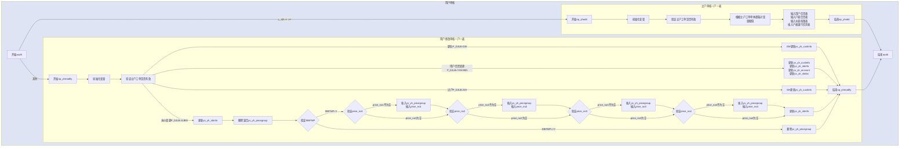


## pg_addmodify_yh.audit


用途：审核审核入口

参数：p_billno 单据流水 	p_person 审核人  	p_djlb 单据类型

```
  --审核审核入口
  PROCEDURE AUDIT(P_BILLNO IN VARCHAR2,
                  P_PERSON IN VARCHAR2,
                  P_DJLB   IN VARCHAR2);
```


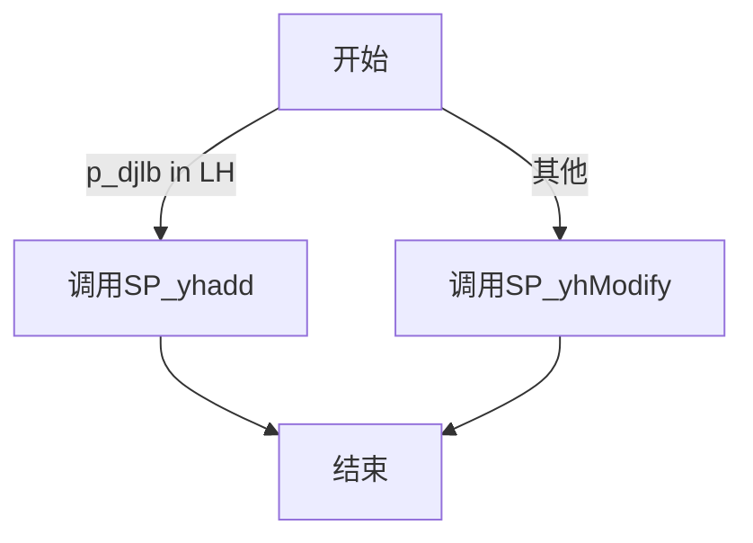

## pg_addmodify_yh.sp_yhadd	

 用途：立户审核（一户一表）

参数：p_djlb 单据类型	p_billno 单据流水	p_person 审核人	p_commit 是否提交

```
 --立户审核（一户一表）
  PROCEDURE SP_yhadd(P_DJLB   IN VARCHAR2,
                     P_billno IN VARCHAR2,
                     P_PERSON IN VARCHAR2,
                     P_COMMIT IN VARCHAR2);
```


~~~mermaid
graph TD
开始-->初始化变量-->验证立户工单是否有效-->根据立户工单单体逐条对变量赋值-->插入用户信息表/户表信息表/水表档案表/户表银行信息表-->结束
~~~


## pg_addmodify_yh.sp_yhmodify

用途：用户修改审核（一户一表）

```mermaid
graph TD
开始-->初始化变量-->验证立户工单是否有效--更名P_DJLB=GM-->GM更新ys_yh_custinfo-->结束
验证立户工单是否有效--用户信息变更P_DJLB=YHXXBG-->更新ys_yh_custinfo\ys_yh_sbinfo\ys_yh_account\ys_yh_sbdoc-->结束
验证立户工单是否有效--过户P_DJLB=GH-->GH更新ys_yh_custinfo-->结束
验证立户工单是否有效--水价变更P_DJLB=SJBG-->更新ys_yh_sbinfo-->删除混合ys_yh_pricegroup
删除混合ys_yh_pricegroup--SBIFMP=Y\price_no1不为空-->插入ys_yh_pricegroup\price_no1
插入ys_yh_pricegroup\price_no1--SBIFMP=Y\price_no2不为空-->插入ys_yh_pricegroup\price_no2
插入ys_yh_pricegroup\price_no2--SBIFMP=Y\price_no3不为空-->插入ys_yh_pricegroup\price_no3
插入ys_yh_pricegroup\price_no3--SBIFMP=Y\price_no4不为空-->插入ys_yh_pricegroup\price_no4
插入ys_yh_pricegroup\price_no4-->更新ys_yh_sbinfo\SBIFMP=Y-->结束
删除混合ys_yh_pricegroup--SBIFMP<>Y-->删除ys_yh_pricegroup-->结束
```


# package pg_add_yh

立户程序包

## pg_add_yh.audit

```
--审核审核入口
  procedure audit(p_billno in varchar2,p_person in varchar2,p_djlb   in varchar2);
```


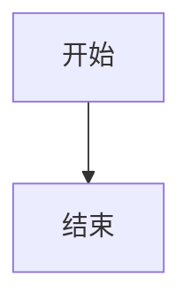


## pg_add_yh.sp_yhadd

  --立户审核（一户一表）
  procedure sp_yhadd(p_djlb in varchar2,p_billno in varchar2,p_person in varchar2,p_commit in varchar2);

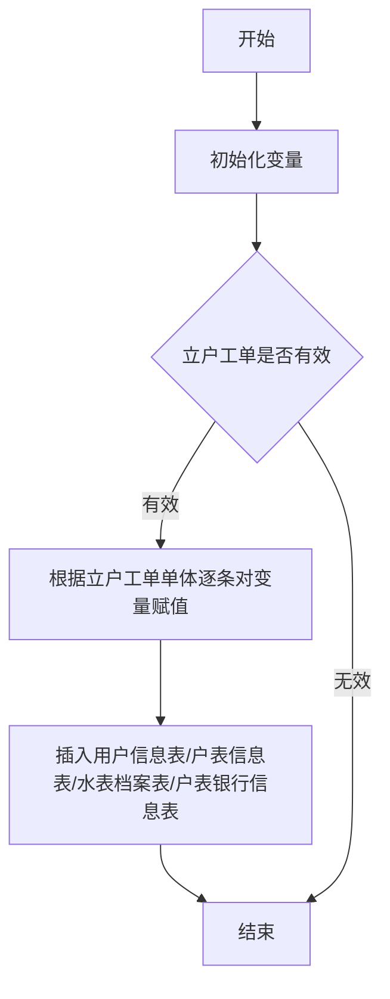


# package pg_dszbill_01

呆死账程序包

```mermaid
graph TD
style pg_dszbill_01.createdszbill fill:#DFE4F4
style pg_dszbill_01.cancelbill fill:#DFE4F4
style pg_dszbill_01.custbillmain fill:#DFE4F4

AS[开始createdszbill]
AE[结束createdszbill]
A01[初始化变量]
A02[更新应收总账明细呆死账标志]
BS[开始createhd]
BE[结束createhd]
B01[初始化变量]
B02[变量赋值]
B03[插入呆死账单头表]
CS[开始createdt]
CE[结束createdt]
C01[初始化变量]
C02[查询账务信息ys_zw_arlist]
C03[变量赋值]
C04[插入到呆账死账单体表中]
DS[开始cancelbill]
DE[结束cancelbill]
D01[验证呆死账单据]
D02[修改应收总账<br>呆死账标志]
D03[删除呆死账单体]
D04[删除呆死账单头]
ES[开始custbillmain]
EE[结束custbillmain]
FS[开始custbill]
FE[结束custbill]
F01[验证呆死账工单是否有效]
F02[更新单体Ys_Gd_Zwdhzdt]
F03[正常账变更为呆坏账<br>更新Ys_Zw_Arlist.Arbadflag=Y<br>Ys_Zw_Arlist.Artrans=D]
F04[更新单头Ys_Gd_Zwdhzd]
F05[呆坏账变更为正常账<br>更新Ys_Zw_Arlist.Arbadflag=N<br>Ys_Zw_Arlist.Artrans=D]
subgraph pg_dszbill_01.createdszbill[创建呆死账]
	AS-->A01-->BS
	subgraph pg_dszbill_01.createhd[创建呆死账单头]
		BS-->B01-->B02-->B03-->BE
	end
	BE-->CS
	subgraph pg_dszbill_01.createdt[创建呆死账单体]
		CS-->C01-->C02-->C03-->C04-->CE
	end
	CE-->A02-->AE
end
subgraph pg_dszbill_01.cancelbill[删除呆死账]
	DS-->D01-->D02-->D03-->D04-->DE
end
subgraph pg_dszbill_01.custbillmain[修改呆死账主程序]
	ES-->FS
	FE-->EE
	subgraph pg_dszbill_01.custbill[修改呆死账]
		FS-->F01-->F02--p_Billtype=8-->F03-->F04-->FE
		F02--p_Billtype<>8-->F05-->F04
	end
end
```


## pg_dszbill_01.createhd

用途：创建呆死账单头

```
procedure createhd(p_dshno in varchar2, p_dshlb in varchar2, p_dshsmfid in varchar2, p_dshdept in varchar2, p_dshcreper in varchar2 );
```

~~~mermaid
graph TD
开始-->初始化变量-->变量赋值-->插入呆死账单头表-->结束
~~~

## pg_dszbill_01.createdt

创建呆账死账单体

```
	procedure createdt(p_dsdno in varchar2, p_dsdrowno in varchar2, p_arid in varchar2);
```

~~~mermaid
graph TD
	开始-->初始化变量-->查询账务信息ys_zw_arlist-->变量赋值-->插入到呆账死账单体表中-->结束
~~~

## pg_dszbill_01.createdszbill

用途：构造呆死帐单据
外部调用，将应收流水号ys_zw_aarist.arid在前台插入到临时表pbparmtemp.c1中	

```
procedure createdszbill(p_dshno in varchar2, p_dshlb in varchar2, p_dshsmfid in varchar2, p_dshdept in varchar2,p_dshcreper in varchar2, p_arid in varchar2);
```

~~~mermaid
graph TD
开始-->初始化变量-->插入单头调用pg_dszbill_01.createhd-->循环应收总账明细逐条插入单体调用pg_dszbill_01.createdt-->更新应收总账明细呆死账标志-->结束
~~~

## pg_dszbill_01.cancelbill

用途：删除呆账死账单据

```
procedure cancelbill(p_billno in varchar2, p_person in varchar2, p_djlb in varchar2); 
```

~~~mermaid
graph TD
开始-->判断呆死账单据是否存在-->修改应收总账信息呆死账标志-->删除呆死账单体-->删除呆死账单头-->结束
~~~

​	

## pg_dszbill_01.custbillmain

```
procedure custbillmain(p_cchno in varchar2, p_per in varchar2,p_billid in varchar2,p_billtype in varchar2);
```

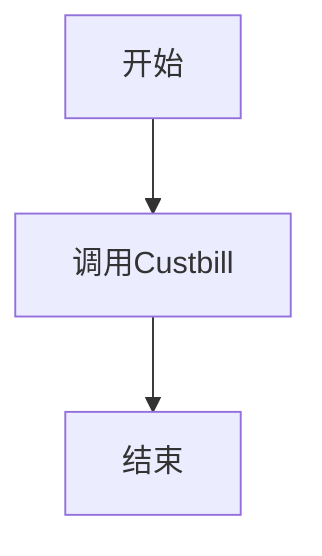

## pg_dszbill_01.custbill

用途：呆死账审核

```
procedure custbill(p_cchno in varchar2, p_per in varchar2, p_billtype in varchar2, p_commit in varchar2);
```

~~~mermaid
graph TD
开始-->验证呆死账工单是否有效-->更新单体Ys_Gd_Zwdhzdt--p_Billtype=8-->正常账变更为呆坏账\更新Ys_Zw_Arlist.Arbadflag=Y\Ys_Zw_Arlist.Artrans=D-->更新单头Ys_Gd_Zwdhzd-->结束
更新单体Ys_Gd_Zwdhzdt--p_Billtype<>8-->呆坏账变更为正常账\更新Ys_Zw_Arlist.Arbadflag=N\Ys_Zw_Arlist.Artrans=D-->更新单头Ys_Gd_Zwdhzd
~~~

# package pg_cbplan

​	抄表计划管理

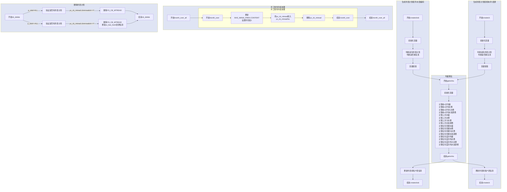


## pg_cbplan.createcb

```
procedure createcb(p_manage_no in varchar2,p_month in varchar2,p_book_no in varchar2);
  参数：p_manage_no：目标营业所
        p_month: 
        p_book_no:  目标表册 
  处理：生成抄表资料
```

~~~mermaid
graph TD
classDef default font-size: 10x;
    开始-->初始化变量-->判断是有抄表计划\是否重复表-->变量赋值-->计算上次水费去年度此均量,调用pg_cbplan.getmrhis-->更新抄表库和户表信息-->结束
~~~

## pg_cbplan.createcbsb

```
  PROCEDURE createCBsb(p_HIRE_CODE in VARCHAR2,
                       p_month     in varchar2,
                       p_sbid      in VARCHAR2);
```

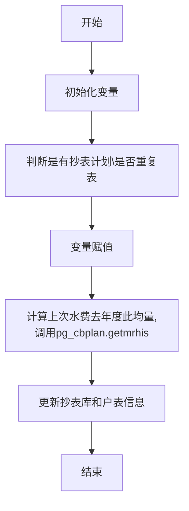


## pg_cbplan.getmrhis

	procedure getmrhis(p_sbid   in varchar2,
	    p_month  in varchar2,
	    o_sl_1   out number,
	    o_je01_1 out number,
	    o_je02_1 out number,
	    o_je03_1 out number,
	    o_sl_2   out number,
	    o_je01_2 out number,
	    o_je02_2 out number,
	    o_je03_2 out number,
	    o_sl_3   out number,
	    o_je01_3 out number,
	    o_je02_3 out number,
	    o_je03_3 out number,
	    o_sl_4   out number,
	    o_je01_4 out number,
	    o_je02_4 out number,
	    o_je03_4 out number);
~~~mermaid
graph TD
style 计算水费 text-align:left
计算水费[计算前n次均量<br>计算前n次均水费<br>计算前n次均污水费<br>计算前n次均水资源费<br>计算上次水量<br>计算上次水费<br>计算上次污水费<br>计算上次水资源费<br>计算去年同期水量<br>计算去年同期水费<br>计算去年同期污水费<br>计算去年同期水资源费<br>计算去年度次均量<br>计算去年度次均水费<br>计算去年度次均污水费<br>计算去年度次均水资源费]
开始-->初始化变量-->计算水费-->结束
~~~

均量（费）算法

1、前n次均量：     从最近抄表水量向历史方向递推12次抄表累计水量（0水量不计次）/递推次数
2、上次水量：      最近一次抄表水量（包括0水量）
3、去年同期水量：  去年同抄表月份的抄表水量（包括0水量）
4、去年度次均量：  去年度的抄表累计水量（0水量不计次）/递推次数
【meterread/meterreadhis】均量记录结构
mrthreesl   number(10)    前n次均量
mrthreeje01 number(13,3)  前n次均水费
mrthreeje02 number(13,3)  前n次均污水费
mrthreeje03 number(13,3)  前n次均水资源费
mrlastsl    number(10)    上次水量
mrlastje01  number(13,3)  上次水费
mrlastje02  number(13,3)  上次污水费
mrlastje03  number(13,3)  上次水资源费
mryearsl    number(10)    去年同期水量
mryearje01  number(13,3)  去年同期水费
mryearje02  number(13,3)  去年同期污水费
mryearje03  number(13,3)  去年同期水资源费
mrlastyearsl    number(10)    去年度次均量
mrlastyearje01  number(13,3)  去年度次均水费
mrlastyearje02  number(13,3)  去年度次均污水费
mrlastyearje03  number(13,3)  去年度次均水资源费

##   pg_cbplan.month_over

```
-- 手工账务月结处理
  --p_smfid 营业所,售水公司
  --p_month 当前月份
  --p_per 操作员
  --p_commit 提交标志
  PROCEDURE month_over(p_HIRE_CODE in varchar2,
                       P_ID        IN VARCHAR2,
                       P_MONTH     IN VARCHAR2,
                       P_PER       IN VARCHAR2,
                       P_COMMIT    IN VARCHAR2)
```

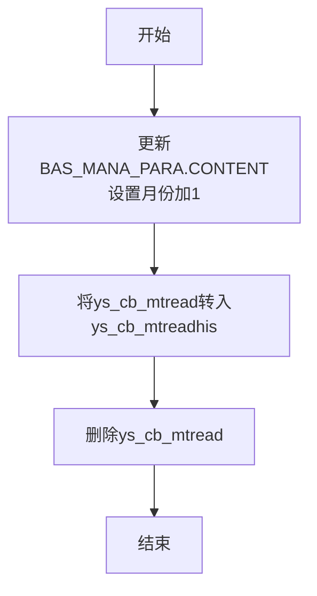

##    pg_cbplan.month_over_all

```
-- 手工账务月结处理
  --p_smfid 营业所,售水公司
  --p_month 当前月份
  --p_per 操作员
  --p_commit 提交标志
  PROCEDURE month_over_all(p_HIRE_CODE in varchar2,
                       P_ID        IN VARCHAR2,
                       P_MONTH     IN VARCHAR2,
                       P_PER       IN VARCHAR2,
                       P_COMMIT    IN VARCHAR2)
```

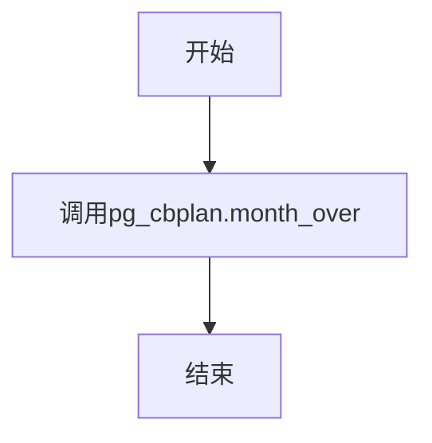

## pg_cbplan.cb_delete

删除抄表计划

```
  PROCEDURE cb_delete(p_HIRE_CODE in varchar2,
                      p_MANAGE_NO in varchar2,
                      P_book_no   IN VARCHAR2,
                      P_MONTH     IN VARCHAR2,
                      p_sbid      in varchar2,
                      P_PER       IN VARCHAR2,
                      P_COMMIT    IN VARCHAR2)
```

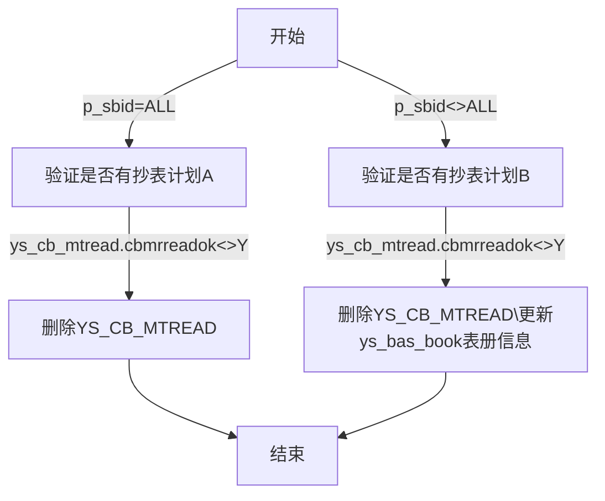


# package pg_cb_cost

算费数据包

```mermaid
graph TD
style pg_cb_cost.costbatch fill:#DFE4F4
style pg_cb_cost.costculate fill:#D3FB9A
style pg_cb_cost.costculatecore fill:#D5807B
style pg_cb_cost.costpiid fill:#87E0B4
style pg_cb_cost.coststep_mon fill:yellow
style pg_cb_cost.coststep_year fill:yellow
AS[开始costbatch]
AE[结束costbatch]
BS[开始costculate]
BE[结束costculate]
B01[变量初始化]
B02[验证水表记录是否有效]
B03[更新抄表信息<br>YS_CB_MTREAD]
B04[更新水表信息YS_YH_SBINFO]
CS[开始costculatecore]
CE[结束costculatecore]
C01[变量初始化]
C02[验证用户信息水表信息是否有效]
C03[计算应收总帐明细<br>RL单条]
C04[价格体系版本赋值<br>BAS_PRICE_NAME]
C05[计算应收总帐明细<br>RLTAB多条]
C06[验证bas_price_name是否存在]
C07[计算应收总帐明细BAS_PRICE_ITEM<br>RLVER带价格体系]
C08[将RLVER转入RLTAB]
C09[验证RLTAB是否存在]
C10[逐条获取RLTAB]
C11[获取混合用水明细ys_yh_pricegroup到<br>PMD]
C12[获取价格体系BAS_PRICE_DETAIL到<br>P_PD]
C14[计算混合用水拆分后水量到V_PMDSL]
C16[统一重算汇总应收水量金额到总账上]
C17[更新应收总账明细<br>YS_ZW_ARLIST]
C18[调用INSRD更新应收总账明细<br>YS_ZW_ARDETAIL]
C19[设置输出参数值<br>MR反馈应收水量水费到原始抄表记录]
DS[开始costpiid]
DE[结束costpiid]
D01[费率计算标志<br>VPDMETHOD=dj]
D02[费率计算标志<br>VPDMETHOD=BAS_PRICE_DETAIL.METHOD]
D03[计算计费时段月数]
D04[基础信息更新<br>YS_ZW_ARDETAIL]
D10{水费计算方法<br>VPDMETHOD}
D11[金额=单价*水量]
D12[金额=固定金额*计费月数]
ES[开始coststep_mon]
EE[结束coststep_mon]
E01[变量初始化]
E02[基础信息赋值]
E03[判断数据是否满足收取阶梯的条件]
E04[计算间隔月]
E05[阶梯金额=阶梯单价*水量<br>+单价*超默认人数*户增水量]
FS[开始coststep_year]
FE[结束coststep_year]
F01[变量初始化]
F02[基础信息赋值]
F03[判断数据是否满足收取阶梯的条件]
F04[计算年累计水量]
F05[阶梯金额=阶梯单价*水量<br>+单价*超默认人数*户增水量]
subgraph pg_cb_cost.costbatch[批量算费入口]
	AS-->BS
	BE-->AE
    subgraph pg_cb_cost.costculate[计划抄表单笔算费-按抄表流水]
		BS-->B01-->B02--本期水量小于<br>最低算费水量-->B03
		B02--总表截量=Y<br>未计费MR.CBMRIFREC=N<br>已提交MR.CBMRIFSUBMIT=Y-->CS
		CE-->B04-->B03-->BE
		subgraph pg_cb_cost.costculatecore[单笔算费核心]
			CS-->C01-->C02-->C03
            C03--非混合用水P_PSCID=0-->C04
            C03--非混合用水P_PSCID<>0-->C05
            C04-->C05
            C05-->C09
            C03--混合用水P_PSCID为空-->C06
            C06-->C07-->C08
            C08-->C09
            C09-->C10-->C11--单一用水PMD不存在-->C12-->DS
            C11--混合用水PMD存在-->C14-->DS
            DE-->C16-->C17-->C18-->C19-->CE
            subgraph pg_cb_cost.costpiid[费率明细计算]
                DS--P_CLASSCTL=Y<br>BAS_PRICE_DETAIL.METHOD包含yjt,njt-->D01-->D03
                DS--其他-->D02-->D03
                D03-->D04-->D10
                D10--固定单价-->D11-->DE
                D10--固定金额-->D12-->DE
                D10--月阶梯-->ES
                EE-->DE
                D10--年阶梯-->FS
                FE-->DE
                subgraph pg_cb_cost.coststep_mon[月阶梯计费]
                	ES-->E01-->E02-->E03-->E04-->E05-->EE
                end
                subgraph pg_cb_cost.coststep_year[年阶梯计费]
					FS-->F01-->F02-->F03-->F04-->F05-->FE
                end
            end
		end
    end
end

```

## pg_cb_cost.costbatch

	procedure costbatch(p_bfid in varchar2);
		--提供外部批量调用
		--参数p_bfid 示例：表册编码1,营销公司编码1|表册编码2,营销公司编码2|表册编码3,营销公司编码3|。。。

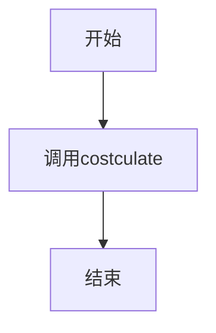


## 	pg_cb_cost.costculate

```
procedure costculate(p_mrid in ys_cb_mtread.id%type, p_commit in number); 
```

​		用途：计划内算费

~~~mermaid
graph TD
开始-->变量初始化-->验证水表记录是否有效--本期水量小于最低算费水量-->更新抄表信息YS_CB_MTREAD
验证水表记录是否有效--总表截量=Y<br>未计费MR.CBMRIFREC=N<br>已提交MR.CBMRIFSUBMIT=Y-->调用单笔算费核心costculatecore-->更新水表信息YS_YH_SBINFO-->更新抄表信息YS_CB_MTREAD-->结束
~~~

## pg_cb_cost.costculatecore

```
procedure costculatecore(mr in out ys_cb_mtread%rowtype,p_trans  in char,p_pscid  in number,p_commit in number);
```

用途：算费核心

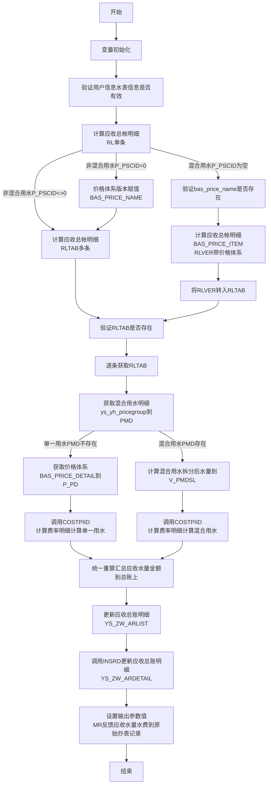

## pg_cb_cost.costpiid

	procedure costpiid(p_rl in out ys_zw_arlist%rowtype,
		     p_mr       in out ys_cb_mtread%rowtype,
		     p_sl       in number,
		     pd         in bas_price_detail%rowtype,
		     pmd        in ys_yh_pricegroup%rowtype,
		     rdtab      in out rd_table,
		     p_classctl in char,
		     p_pscid    in number,
		     p_commit   in number);
用途：费率明细计算

--p_classctl（y：强制不使用阶梯计费方法；n：计算阶梯，如果是的话）

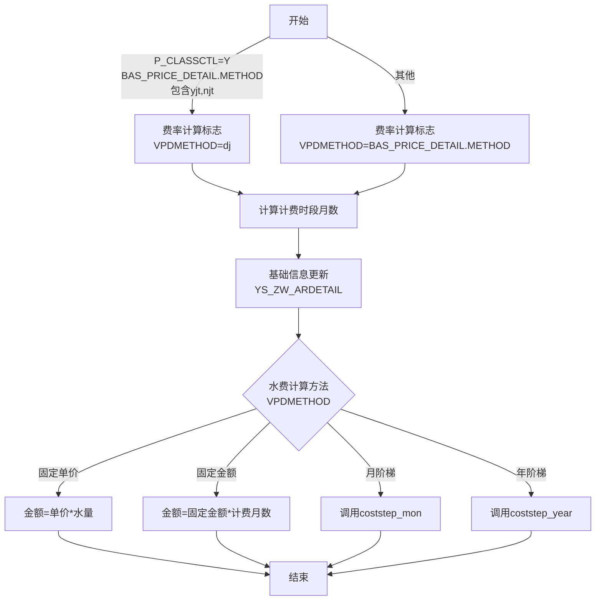


## pg_cb_cost.coststep_mon

```
procedure coststep_mon(p_rl in out ys_zw_arlist%rowtype,
		 p_mr       in out ys_cb_mtread%rowtype,
		 p_sl       in number,
		 p_adjsl    in number,
		 p_adjdj    in number,
		 pd         in bas_price_detail%rowtype,
		 rdtab      in out rd_table,
		 p_classctl in char,
		 pmd        in ys_yh_pricegroup%rowtype);
```

​	--rd.rdpiid；rd.rdpfid；rd.rdpscid为必要参数

```mermaid
graph TD
开始-->变量初始化-->基础信息赋值-->判断数据是否满足收取阶梯的条件-->计算间隔月-->阶梯金额=阶梯单价*水量+单价*超默认人数*户增水量-->结束
```


## pg_cb_cost.coststep_year

		procedure coststep_year(p_rl in out ys_zw_arlist%rowtype,
			  p_sl       in number,
			  p_adjsl    in number,
			  p_adjdj    in number,
			  pd         in bas_price_detail%rowtype,
			  rdtab      in out rd_table,
			  p_classctl in char,
			  pmd        ys_yh_pricegroup%rowtype,
			  pmonth     in varchar2);

逻辑与[pg_cb_cost.coststep_mon](##pg_cb_cost.coststep_mon)相同

```mermaid
graph TD
开始-->变量初始化-->基础信息赋值-->判断数据是否满足收取阶梯的条件-->计算年累计水量-->阶梯金额=阶梯单价*水量+单价*超默认人数*户增水量-->结束
```

## pg_cb_cost.insrd

	procedure insrd(rd in rd_table, p_commit in number);
将rd插入到ys_zw_ardetail

## pg_cb_cost.getmin

```
function getmin(n1 in number, n2 in number) return number; 
	if nvl(n1, 0) <= nvl(n2, 0) then return nvl(n1, 0); else return nvl(n2, 0);end if;
```

## pg_cb_cost.getmax

```
function getmax(n1 in number, n2 in number) return number;
	if nvl(n1, 0) >= nvl(n2, 0) then return nvl(n1, 0); else return nvl(n2, 0);end if;
```

## pg_cb_cost.fboundpara

​		返回字符串中“|”的数量

	function fboundpara(p_parastr in clob) return integer is
	--一维数组规则：#####,####,####|
	--二维数组规则：#####,####,####|#####,####,#######|##,####,####|
	i     integer;
	n     integer := 0;
	vchar nchar(1);
	begin
	for i in 1 .. length(p_parastr) loop
		vchar := substr(p_parastr, i, 1);
		if vchar = '|' then n := n + 1; end if;
	end loop;
	return n;
## pg_cb_cost.fgetpara

​	返回字符串中指定元素位置的值

# package pg_paid

收费程序包

```mermaid
graph TD
AS[开始poscustforys]
AE[结束poscustforys]
A01[参数p_arstr整理为<br>结果集V_PARM_ARS]
BS[开始poscust]
BE[结束poscust]
B01[校验是否进行划扣<br>发出标志AROUTFLAG不为Y]
CS[开始paycust]
CE[开始paycust]
C01[参数初始化]
C02[校验水表<br>校验用户<br>校验银行<br>校验应收流水]
C03[付款基础信息赋值]
C04{允许拆账}
C05{允许销帐<br>违约金分帐}
C06[重算预存发生<br>重算预存期末<br>更新用户预存余额]
C07[返回预存余额]
DS[开始payzwarpre]
DE[结束payzwarpre]
D01[将P_PARM_ARS逐条<br>读出到P_PARM_AR]
D02[调用PG_CB_COST.FBOUNDPARA<br>从P_PARM_AR.ARDPIIDS获取<br>一行一费项待销标志一行一费项]
D03[根据一行一费项<br>待销标志将应收总账<br>拆成待销账数据集<br>和不销账数据集]
D04{待销笔数}
D05{不销笔数}
D06[在本期追加目标应收待销帐部分]
D07[在本期追加目标应收继续挂欠费部分]
D08[重构销帐包返回]
D09[删除单条P_PARM_ARS]
ES[开始zwarreversecore]
EE[结束zwarreversecore]
E01[初始化变量]
E02[变量基本信息赋值]
E03[RL设置负值抄见水量<br>RL设置负值应收金额<br>RL设置负值应收水量<br>RL设置负值滞纳金<br>RL设置负值手续费]
E04[计算期初预存<br>计算期末预存<br>计算本期发生金额]
E05[RD设置负值应收金额<br>RD设置负值应收水量<br>RD设置负值实收水量<br>RD设置负值实收金额<br>RD设置负值调整水量<br>RD设置负值调整金额]
E06[设置返回值]
E07[更新应收总账明细]
FS[开始paywyjpre]
FE[结束paywyjpre]
F01[变量初始化]
F02[使用PG_CB_COST.FGETPARA<br>将P_PARM_AR.ARDPIIDS拆成<br>费项待销标志费项待销]
F03[验证费项待销标志=N<br>费项=ZNJ]
F04[设置参数滞纳金<br>滞纳金减免标志]
F05[插入应收总账明细]
GS[开始payzwarcore]
GE[结束payzwarcore]
G01[从P_PARM_ARS<br>中获取流水号]
G02[逐条计算待销账变量]
G03[更新销账记录]
HS[开始precust]
HE[结束precust]
IS[开始precore]
IE[结束precore]
I01[校验水表信息用户信息]
I02[交易表基础参数计算<br>更新收款<br>更新本期发生<br>更新期末预存]
I03[校验期末预存]
I04[插入YS_ZW_PAIDMENT]
I05[更新YS_YH_SBINFO]
JS[开始precustback]
JE[结束precustback]

style pg_paid.poscustforys fill:#DFE4F4
style pg_paid.poscust fill:#D3FB9A
style pg_paid.paycust fill:#D5807B
style pg_paid.precust fill:#D5807B
style pg_paid.precustback fill:#D5807B
style pg_paid.precore fill:#D5807B
style pg_paid.payzwarpre fill:#87E0B4
style pg_paid.paywyjpre fill:#87E0B4
style pg_paid.paywyjpre fill:#87E0B4
style pg_paid.payzwarcore fill:#87E0B4

subgraph pg_paid.poscustforys[柜台缴费一表参数简化版]
	AS-->A01-->BS
	subgraph pg_paid.poscust[水司柜台缴费一表]
		BS-->B01--P_PARM_ARS为空<br>P_PAYMENT大于0-->HS
		HE-->BE
		B01--P_PARM_ARS为空<br>P_PAYMENT不大于0-->JS
		JE-->BE
		B01--P_PARM_ARS不为空-->CS
		CE-->BE
		subgraph pg_paid.paycust[水表多应收销帐]
			CS-->C01-->C02-->C03-->C04
			C04--允许-->DS
			DE-->CE
			C05--允许-->FS
			FE-->GS
			GE-->C06-->C07-->CE
			C04--不允许-->C05
			C05--不允许-->GS
			subgraph pg_paid.payzwarpre[部分费用项目销帐前拆分应收一应收帐]
				DS-->D01-->D02-->D03-->D04
				D04--待销笔数不为0-->D05
				D05--不销笔数不为0-->ES
				EE-->D06-->D07-->D08-->DE
				D04--待销笔数为0-->D09-->DE
				D05--不销笔数为0-->DE
				subgraph pg_paid.zwarreversecore[应收冲正核心]
					ES-->E01-->E02-->E03-->E04-->E05-->E06-->E07-->EE
				end
			end
			subgraph pg_paid.paywyjpre[销帐违约金分帐销帐包预处理]
				FS-->F01-->F02-->F03-->F04-->F05-->FE
			end
			subgraph pg_paid.payzwarcore[实收销帐处理核心]
				GS-->G01-->G02-->G03-->GE
			end
		end
		subgraph pg_paid.precust[预存充值]
			HS--P_PAYMENT不小于等于0-->HE
		end
		HS--P_PAYMENT小于等于0-->IS
		IE-->HE
		subgraph pg_paid.precustback[预存退费]
			JS--P_PAYMENT不大于等于0-->JE
		end
		JS--P_PAYMENT大于等于0-->IS
		IE-->JE
		subgraph pg_paid.precore[预存实收处理核心]
			IS-->I01-->I02-->I03-->I04-->I05-->IE
		end
	end
	BE-->AE
end
```


## pg_paid.obtwyj

```
function obtwyj(p_sdate in date, p_edate in date, p_je in number) return number;
	v_result := p_je * (trunc(p_edate) - trunc(p_sdate) + 1) * 0.003;
```

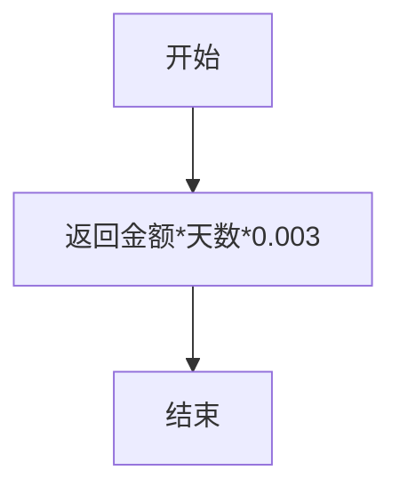


## pg_paid.obtwyjadj

		--违约金计算
		function obtwyjadj(p_arid     in varchar2, --应收流水
			     p_ardpiids in varchar2, --应收明细费项串'01|02|03'
			     p_edate    in date --终算日'不计入'违约日,参数格式'yyyy-mm-dd'
			     ) return number is
```mermaid
graph TD
开始-->初始化变量-->变量赋值--是否滞纳金=N-->返回0-->结束
变量赋值--是否滞纳金=Y\滞纳金减免=Y-->返回违约金-->结束
变量赋值--其他-->调用obtwyj计算滞纳金-->结束
```


## pg_paid.poscustforys

```
procedure poscustforys(p_sbid     in varchar2,
	 p_arstr    in varchar2,
	 p_position in varchar2,
	 p_oper     in varchar2,
	 p_paypoint in varchar2,
	 p_payway   in varchar2,
	 p_payment  in number,
	 p_batch    in varchar2,
	 p_pid      out varchar2);
```

```mermaid
graph TD
开始-->参数p_arstr整理为结果集V_PARM_ARS-->调用poscust-->结束
```


--处理p_arstr
--水司柜台缴费（一表）,参数简化版
--'123456789,Y*01!Y*02!Y*03!,0.10,0,0,0|123456789,Y*01!Y*02!Y*03!,0.10,0,0,0|'

## pg_paid.poscust

```mermaid
graph TD
A01[校验是否进行划扣<br>发出标志AROUTFLAG不为Y]
开始-->A01--P_PARM_ARS为空P_PAYMENT大于0-->调用PRECUST单缴预存-->结束
A01--P_PARM_ARS为空P_PAYMENT不大于0-->调用PRECUSTBACK退预存-->结束
A01--P_PARM_ARS不为空-->调用PAYCUST水表多应收销帐-->结束
```


```
procedure poscust(p_sbid in varchar2,
	p_parm_ars in parm_payar_tab,
	p_position in varchar2,
	p_oper     in varchar2,
	p_paypoint in varchar2,
	p_payway   in varchar2,
	p_payment  in number,
	p_batch    in varchar2,
	p_pid      out varchar2) is
	
```


```
水司柜台缴费（一表）
【输入参数说明】：
p_sbid		in varchar2 :单一水表编号
p_parm_ars	in out parm_payr_tab :单表待销应收包成员参数如下：
	arid  in number :应收流水（依此成员次序销帐）
	ardpiids in varchar2 :费用项目串（待销费用项目,由前台勾选否(Y/N)+费项ID组成的二维数组（基于PG_CB_COST.FGETPARA二维数组规范），例如：Y,01|Y,02|N,03|,次序很重要）
	arznj in number :传入的违约金（本过程内不计算不校验），传多少销多少
	fee1 in number  :其他非系统费项1
p_position      in varchar2 :缴费单位，营销架构中营业所编码，实收计帐单位
p_oper		in varchar2 :销帐员，柜台缴费时销帐人员与收款员统一
p_payway	in varchar2 :付款方式，每交易有且仅有一种付款方式
p_payment	in number   :实收，即为（付款-找零），付款与找零在前台计算和校验
```

## pg_paid.paycust

一水表多应收销帐

	procedure paycust(p_sbid        in varchar2,
		    p_parm_ars    in parm_payar_tab,
		    p_trans       in varchar2,
		    p_position    in varchar2,
		    p_paypoint    in varchar2,
		    p_bdate       in date,
		    p_bseqno      in varchar2,
		    p_oper        in varchar2,
		    p_payway      in varchar2,
		    p_payment     in number,
		    p_pid_source  in varchar2,
		    p_commit      in number,
		    p_ctl_msg     in number,
		    p_ctl_pre     in number,
		    p_batch       in out varchar2,
		    p_seqno       in out varchar2,
		    p_pid         out varchar2,
		    o_remainafter out number);
```mermaid
graph TD
开始-->参数初始化-->水表\用户\银行\应收流水校验-->付款基础信息赋值-->A1{允许拆账}--允许-->调用PAYZWARPRE-->A2{允许销帐违约金分帐}--允许-->调用PAYWYJPRE-->调用销账核心PAYZWARCORE-->重算预存发生\预存期末\更新用户预存余额-->返回预存余额-->结束
A1--不允许-->A2
A2--不允许-->调用销账核心PAYZWARCORE
```


## pg_paid.payzwarpre

```
procedure payzwarpre(p_parm_ars in out parm_payar_tab, p_commit in number default 不提交); 
```

部分费用项目销帐前拆分应收（一应收帐）

```mermaid
graph TD
开始-->将P_PARM_ARS逐条读出到P_PARM_AR-->调用PG_CB_COST.FBOUNDPARA从P_PARM_AR.ARDPIIDS获取一行一费项待销标志一行一费项-->根据一行一费项待销标志将应收总账拆成待销账数据集和不销账数据集-->A1{待销笔数}--待销笔数不为0-->A2{不销笔数}--不销笔数不为0-->调用ZWARREVERSECORE将原帐冲正-->在本期追加目标应收待销帐部分-->在本期追加目标应收继续挂欠费部分-->重构销帐包返回-->结束
A1--待销笔数为0-->删除单条P_PARM_ARS-->结束
A2--不销笔数为0-->结束
```

## pg_paid.zwarreversecore

应收冲正核心

	procedure zwarreversecore(p_arid_source         in varchar2,
		    p_artrans_reverse     in varchar2,
		    p_pbatch_reverse      in varchar2,
		    p_pid_reverse         in varchar2,
		    p_ppayment_reverse    in number,
		    p_memo                in varchar2,
		    p_ctl_mircode         in varchar2,
		    p_commit              in number default 不提交,
		    o_arid_reverse        out varchar2,
		    o_artrans_reverse     out varchar2,
		    o_arje_reverse        out number,
		    o_arznj_reverse       out number,
		    o_arsxf_reverse       out number,
		    o_arsavingbq_reverse  out number,
		    io_arsavingqm_reverse in out number);
```mermaid
graph TD
开始-->初始化变量-->变量基本信息赋值-->RL设置负值\抄见水量\应收金额\应收水量\滞纳金\手续费-->计算期初预存\期末预存\本期发生金额-->RD设置负值\应收金额\应收水量\实收水量\实收金额\调整水量\调整金额-->设置返回值-->更新应收总账明细-->结束
```

## pg_paid.paywyjpre

销帐违约金分帐销帐包预处理

```
procedure paywyjpre(p_parm_ars in out parm_payar_tab, p_commit in number default 不提交); 
```

~~~mermaid
graph TD
开始-->变量初始化-->使用PG_CB_COST.FGETPARA将P_PARM_AR.ARDPIIDS拆成费项待销标志\费项待销-->验证费项待销标志=N\费项=ZNJ-->设置参数滞纳金\滞纳金减免标志-->插入应收总账明细-->结束

~~~

## pg_paid.payzwarcore

实收销帐处理核心

	procedure payzwarcore(p_pid          in varchar2,
		p_batch        in varchar2,
		p_payment      in number,
		p_remainbefore in number,
		p_paiddate     in date,
		p_paidmonth    in varchar2,
		p_parm_ars     in parm_payar_tab,
		p_commit       in number default 不提交,
		o_sum_arje     out number,
		o_sum_arznj    out number,
		o_sum_arsxf    out number);
```mermaid
graph TD
开始-->从P_PARM_ARS中获取流水号-->逐条计算待销账变量-->更新销账记录-->结束
```


## pg_paid.precust

	procedure precust(p_sbid        in varchar2,
		    p_position    in varchar2,
		    p_oper        in varchar2,
		    p_payway      in varchar2,
		    p_payment     in number,
		    p_memo        in varchar2,
		    p_batch       in out varchar2,
		    o_pid         out varchar2,
		    o_remainafter out number);
		预存充值（一表）
```mermaid
graph TD
开始--P_PAYMENT小于等于0-->调用预PRECORE存实收处理核心-->结束
开始--其他-->结束
```

## pg_paid.precustback

	procedure precustback(p_sbid        in varchar2,
		p_position    in varchar2,
		p_oper        in varchar2,
		p_payway      in varchar2,
		p_payment     in number,
		p_memo        in varchar2,
		p_batch       in out varchar2,
		o_pid         out varchar2,
		o_remainafter out number);
		预存退费（一表）
```mermaid
graph TD
开始--P_PAYMENT大于等于0-->调用预PRECORE存实收处理核心-->结束
开始--P_PAYMENT不大于等于0-->结束
```

## pg_paid.precore

	procedure precore(p_sbid        in varchar2,
		    p_trans       in varchar2,
		    p_position    in varchar2,
		    p_paypoint    in varchar2,
		    p_bdate       in date,
		    p_bseqno      in varchar2,
		    p_oper        in varchar2,
		    p_payway      in varchar2,
		    p_payment     in number,
		    p_commit      in number,
		    p_memo        in varchar2,
		    p_batch       in out varchar2,
		    p_seqno       in out varchar2,
		    o_pid         out varchar2,
		    o_remainafter out number);
		预存实收处理核心
		【输入参数说明】：
		p_sbid        in varchar2：指定预存发生的水表编号
		p_trans      in varchar2：指定预存发生计帐实收事务
		p_position      in varchar2：指定预存发生缴费单位
		p_paypoint   in varchar2：指定预存发生缴费地点
		p_bdate      in date：指定预存发生银行帐务日期
		p_bseqno     in varchar2：指定预存发生银行交易流水
		p_oper       in varchar2：预存收款人
		p_payway     in varchar2：预存发生付款方式
		p_payment    in number：预存发生金额（+/-）
		p_commit     in number：是否提交
		p_memo       in varchar2：备注信息
		p_batch      in out number：可空，绑定批次
		p_seqno      in out number：可空，绑定批次流水
		【输出参数说明】：
		p_pid        out number：预存发生记录计帐成功后返回的实收流水号
```mermaid
graph TD
开始-->校验水表信息用户信息--通过-->交易表基础参数计算,更新收款\本期发生\期末预存-->校验期末预存-->插入YS_ZW_PAIDMENT-->更新YS_YH_SBINFO-->结束
```


## pg_paid.fmid

	function fmid(p_str in varchar2, p_sep in varchar2) return integer;
		返回p_str中p_sep的个数+1
# package pg_balanceadj_01

```mermaid
graph TD
AS[开始approve]
AE[结束approve]
BS[开始sp_balanceadj]
BE[结束sp_balanceadj]
B01[验证余额调整单头<br>Ys_Gd_Balanceadjhd]
B02[验证余额调整单体<br>Ys_Gd_Balanceadjdt]
B03[判断Ys_Zw_Arlist是否欠费]
B04[更新余额调整单头<br>Ys_Gd_Balanceadjhd<br>审核日期审核人审核标志]
CS[开始precustback]
CE[结束precustback]
DS[开始precore]
DE[结束precore]
D01[校验水表信息用户信息]
D02[交易表基础参数计算<br>更新收款<br>更新本期发生<br>更新期末预存]
D03[校验期末预存]
D04[插入YS_ZW_PAIDMENT]
D05[更新YS_YH_SBINFO]

style pg_balanceadj_01.approve fill:#DFE4F4
style pg_balanceadj_01.sp_balanceadj fill:#D3FB9A
style pg_paid.precustback fill:#D5807B
style pg_paid.precore fill:#87E0B4


subgraph pg_balanceadj_01.approve[余额调整单据提交入口]
	AS--p_Djlb=36或<br>p_Djlb=39-->BS
	BE-->AE
	AS--其他-->AE
	subgraph pg_balanceadj_01.sp_balanceadj[余额调整减免单体]
		BS-->B01-->B02-->B03-->CS
		CE-->B04-->BE
		subgraph pg_paid.precustback[预存退费一表]
			CS--P_PAYMENT大于等于0-->DS
			DE-->CE
			CS--P_PAYMENT不大于等于0-->CE
			subgraph pg_paid.precore[预存实收处理核心]
				DS-->D01-->D02-->D03-->D04-->D05-->DE
			end
		end
	end
end

```


## pg_balanceadj_01.approve

```
procedure approve(p_billno in varchar2,
	p_person in varchar2,
	p_billid in varchar2,
	p_djlb   in varchar2);
	--单据提交入口过程
```

```mermaid
graph TD
开始--p_Djlb=36或p_Djlb=39-->调用Sp_Balanceadj-->结束
开始--其他-->结束
```

## pg_balanceadj_01.sp_balanceadj

```
--减免单体
procedure sp_balanceadj(p_bill_id in varchar2, --批次流水
	p_per     in varchar2, --操作员
	p_commit  in varchar2 --提交标志;
	);
```

```mermaid
graph TD
开始-->验证余额调整单头Ys_Gd_Balanceadjhd-->验证余额调整单体Ys_Gd_Balanceadjdt-->判断Ys_Zw_Arlist是否欠费-->调用Pg_Paid.Precustback-->更新余额调整单头Ys_Gd_Balanceadjhd审核日期审核人审核标志-->结束

```

# package pg_arsplit_01

拆账程序包

```mermaid
graph TD
AS[开始approve]
AE[结束approve]
BS[开始sp_arsplit]
BE[结束sp_arsplit]
B01[检查单头<br>Ys_Gd_Arsplithd]
B02[检查单体<br>Ys_Gd_Arsplitdt]
B03[更新单头<br>Ys_Gd_Arsplithd]
CS[开始sp_arsplit_change_one]
CE[结束sp_arsplit_change_one]
C01[拆分前水量检查]
C02[更新分账后的两笔<br>Ys_Zw_Arlist]
C03[更新分账后的两笔<br>Ys_Zw_Ardetail]
C04[检查分账后金额]
DS[开始sp_reccz_one_01]
DE[结束sp_reccz_one_01]
D01[变量赋值]
D02[插入Ys_Zw_Ardetail负值<br>并更新冲正标志]
D03[插入Ys_Zw_Arlist负值<br>并更新冲正标志]
D04[更新水表信息<br>Ys_Yh_Sbinfo]

style pg_arsplit_01.approve fill:#DFE4F4
style pg_arsplit_01.sp_arsplit fill:#D3FB9A
style pg_arsplit_01.sp_arsplit_change_one fill:#D5807B
style pg_arsplit_01.sp_reccz_one_01 fill:#87E0B4

subgraph pg_arsplit_01.approve[拆分账单单据提交入口]
	AS--p_Djlb=3-->BS
	BE-->AE
	AS--p_Djlb<>3-->AE
	subgraph pg_arsplit_01.sp_arsplit[拆分账单过程]
		BS-->B01-->B02-->CS
		CE-->B03-->BE
		subgraph pg_arsplit_01.sp_arsplit_change_one[拆分账单单体]
			CS-->C01-->C02-->C03-->C04-->DS
			DE-->CE
			subgraph pg_arsplit_01.sp_reccz_one_01
				DS-->D01-->D02-->D03--ARTRANS<>3-->D04-->DE[插入单负应收与应收冲正]
				D03--ARTRANS=3-->DE
			end
		end
	end
end

```


## pg_arsplit_01.approve

	--单据提交入口过程
	procedure approve(p_billno in varchar2,
		    p_person in varchar2,
		    p_billid in varchar2,
		    p_djlb   in varchar2);
```mermaid
graph TD
开始--p_Djlb=3-->调用Sp_Arsplit-->结束
开始--p_Djlb<>3-->结束
```

## pg_arsplit_01.sp_arsplit

	--拆分账单单体
	procedure sp_arsplit(p_bill_id in varchar2, --批次流水
		       p_per     in varchar2, --操作员
		       p_commit  in varchar2 --提交标志;
		       );
```mermaid
graph TD
开始-->检查单头Ys_Gd_Arsplithd-->检查单体Ys_Gd_Arsplitdt-->调用Sp_Arsplit_change_one-->更新单头Ys_Gd_Arsplithd-->结束
```

## pg_arsplit_01.sp_arsplit_change_one

	--拆分账单单体
	procedure sp_arsplit_change_one(p_arsplitdt   in ys_gd_arsplitdt%rowtype,  
		       p_per     in varchar2, --操作员
		       p_commit  in varchar2 --提交标志;
		       ); 
```mermaid
graph TD
开始-->拆分前水量检查-->更新分账后的两笔Ys_Zw_Arlist-->更新分账后的两笔Ys_Zw_Ardetail-->检查分账后金额-->调用Sp_Reccz_One_01原应收账冲正-->结束
```

## pg_arsplit_01.sp_reccz_one_01

	--插入单负应收与应收冲正  --单条                     
	procedure sp_reccz_one_01(p_arid   in ys_zw_arlist.arid%type, -- 行变量
			    p_commit in varchar --是否提交标志
			    );
```mermaid
graph TD
开始-->变量赋值-->插入Ys_Zw_Ardetail负值并更新冲正标志-->插入Ys_Zw_Arlist负值并更新冲正标志--ARTRANS<>3-->更新水表信息Ys_Yh_Sbinfo-->结束
插入Ys_Zw_Arlist负值并更新冲正标志--ARTRANS=3-->结束
```

##   pg_arsplit_01.sf_recfzsl

```
--应收分账处理  
  --输入应收流水，分帐金额，
  --返回分帐水量
  --1按水量乘单价分
  --2分到不足一吨水为止
  --3从高水量减起减到水量为1吨为止
  FUNCTION Sf_Recfzsl(p_Arid IN VARCHAR2, --分帐流水
                      p_Arje IN NUMBER --分帐金额
                      ) RETURN NUMBER;
```

```mermaid
graph TD
A02[找到可拆分数据将C6设置为1]
A03[插入临时表Ysparmtemp]
A04[验证拆分金额<br>大于金额不允许拆分]
A05[根据C6取拆分数据行<br>C4拆账水量<br>C5拆账金额]
A06[更新临时表Ysparmtemp]
开始-->A02-->A03-->A04-->A05-->A06-->结束

```


# package pg_sbtrans

更换水表程序包

```mermaid
graph TD
AS[开始audit]
AE[结束audit]
BS[开始sp_sbtrans]
BE[结束sp_sbtrans]
B01[验证换表工单<br>ys_gd_metertranshd]
B02[验证换表工单是否已审核<br>ys_gd_metertranshd]
B03[将审核标志设置为已审核]
CS[开始sp_sbtransone]
CE[结束sp_sbtransone]
C01[验证水表<br>验证用户<br>验证水表资料]
C02{P_TYPE}
C03[更新水表<br>更新用户<br>更新水表资料<br>状态为销户]
C04[插入余量信息<br>YS_GD_SBADDSL]
C05[更新水表<br>更新用户<br>更新水表资料<br>状态为立户]
C06[更新水表<br>更新用户<br>更新水表资料<br>状态为欠费停水]
C07[更新水表<br>更新用户<br>更新水表资料<br>状态为报停]
C08[验证是否已抄表未算费]

style pg_sbtrans.audit fill:#DFE4F4
style pg_sbtrans.sp_sbtrans fill:#D3FB9A
style pg_sbtrans.sp_sbtransone fill:#D5807B

subgraph pg_sbtrans.audit
	AS-->BS
	BE-->AE
	subgraph pg_sbtrans.sp_sbtrans
		BS-->B01-->B02-->CS
		CE-->B03-->BE
		subgraph pg_sbtrans.sp_sbtransone
			CS-->C01-->C02
			C02--销户拆表-->C03-->C04-->CE
			C02--口径变更<br>换阀门<br>恢复供水<br>校表<br>复装-->C05-->C04
			C02--欠费停水-->C06-->C04
			C02--报停-->C07-->C04
			C02--故障换表<br>周期换表-->C08-->C05
		end
	end
end

```


## pg_sbtrans.audit

程序入口

	procedure audit(p_hire_code in varchar2,
		    p_billno in varchar2,
		    p_person in varchar2,
		    p_billid in varchar2,
		    p_djlb   in varchar2);
```mermaid
graph TD
开始-->调用sp_sbtrans-->结束
```

## pg_sbtrans.sp_sbtrans

	--工单主程序
	procedure sp_sbtrans(p_hire_code in varchar2,
			  p_type      in varchar2, --操作类型
			  p_bill_id   in varchar2, --批次流水
			  p_per       in varchar2, --操作员
			  p_commit    in varchar2 --提交标志
			  );
```mermaid
graph TD
开始-->验证换表工单ys_gd_metertranshd是否存在-->验证换表工单是否已审核ys_gd_metertranshd.check_flag=Y-->根据换表工单单体逐条调用SP_SBTRANSONE-->将审核标志设置为已审核-->结束
```

## pg_sbtrans.sp_sbtransone

	--工单单个审核过程
	procedure sp_sbtransone(p_type   in varchar2, --类型
			     p_person in varchar2, -- 操作员
			     p_md     in ys_gd_metertransdt%rowtype --单体行变更
			     );
```mermaid
graph TD
开始-->验证水表\用户\水表资料是否存在-->A1{P_TYPE}
A1--销户拆表-->更新水表\用户\水表资料状态为销户-->插入余量信息YS_GD_SBADDSL-->结束
A1--口径变更\换阀门\恢复供水\校表\复装-->更新水表\用户\水表资料状态为立户-->插入余量信息YS_GD_SBADDSL
A1--欠费停水-->更新水表\用户\水表资料状态为欠费停水-->插入余量信息YS_GD_SBADDSL
A1--报停-->更新水表\用户\水表资料状态为报停-->插入余量信息YS_GD_SBADDSL
A1--故障换表\周期换表-->验证是否已抄表未算费-->更新水表\用户\水表资料状态为立户
```

# package pg_artrans_01

## pg_artrans_01.approve

```
--单据提交入口过程
procedure approve(p_billno in varchar2,
	    p_person in varchar2,
	    p_billid in varchar2,
	    p_djlb   in varchar2);
```

```mermaid
graph TD
开始--p_djlb的值为O\T\6\N\13\14\21\23-->追量,调用Sp_Rectrans-->结束
开始--p_djlb的值为G-->调整减免,调用RecAdjust-->结束
开始--p_djlb的值为12-->实收冲正,调用Sp_Paidbak-->结束
```


## pg_artrans_01.sp_rectrans

```
--追量收费 
procedure sp_rectrans(p_no in varchar2, p_per in varchar2);
```

```mermaid
graph TD
A01[验证工单是否存在有效]
A02[验证用户\水表\水表档案\水表账务\表册是否存在]
A03[追收插入抄表计划,调用Sp_Insertmr]
A04[验证价格版本\该月水价是否归档]
A05[计算水费,调用Pg_Cb_Cost.Costculate]
A06[Ys_Cb_Mtread转入Ys_Cb_Mtreadhis]
A07[更新Ys_Yh_Sbinfo]
A08[更新追量工单单头Ys_Gd_Araddhd审核状态]
A09[更新Ys_Yh_Sbinfo.Sbnewflag=N和本期读数]
C1{验证抄表流水}
C2{是否按历史水价算费}

开始-->A01-->A02-->A03-->C1
C1--Ys_Zw_Arlist.Armrid不为空-->C2
C1--Ys_Zw_Arlist.Armrid为空-->A08
C2--If_Rechis为Y-->A04-->A05
C2--If_Rechis不为Y-->A05
A05-->A06
A06--Ecode_Flag为Y-->A07-->A08
A06--Ecode_Flag不为Y-->A08
A08--Ecode_Flag为N-->A09-->结束
A08--Ecode_Flag不为N-->结束
```


## pg_artrans_01.sp_insertmr

```
--追收插入抄表计划   
procedure sp_insertmr(rth         in ys_gd_araddhd%rowtype, --追收头
		p_mriftrans in varchar2, --抄表数据事务
		mi          in ys_yh_sbinfo%rowtype, --水表信息
		omrid       out ys_cb_mtread.id%type);
```

## pg_artrans_01.sp_insertmrhis

```
--追收插入抄表计划到历史库
procedure sp_insertmrhis(rth         in ys_gd_araddhd%rowtype, --追收头
		p_mriftrans in varchar2, --抄表数据事务
		mi          in ys_yh_sbinfo%rowtype, --水表信息
		omrid       out ys_cb_mtread.id%type);
```

## pg_artrans_01.recadjust

```
--调整减免
procedure recadjust(p_billno in varchar2, --单据编号
	     p_per    in varchar2, --完结人
	     p_memo   in varchar2, --备注
	     p_commit in varchar --是否提交标志
	     ); 
```

## pg_artrans_01.sp_paidbak

```
---实收冲正
procedure sp_paidbak(p_no in varchar2, p_per in varchar2);
```

# package pg_arznj_01

```mermaid
graph TD
style pg_arznj_01.approve fill:#DFE4F4
style pg_arznj_01.sp_arznjjm fill:#D3FB9A
AS[开始approve]
AE[结束approve]
BS[开始sp_arznjjm]
BE[结束sp_arznjjm]
B01[验证滞纳金调整单头<br>Ys_Gd_Znjadjusthd]
B02[验证滞纳金调整单体<br>Ys_Gd_Znjadjustdt]
B03[更新应收总账明细<br>Ys_Zw_Arlist<br>减免标志减免金额]
B04[更新滞纳金减免单头<br>Ys_Gd_Znjadjusthd<br>审核日期审核人审核标志]
B05[更新应收总账明细<br>Ys_Zw_Arlist<br>减免标志更新<br>减免金额=减免金额*减免比例]
B06[更新应收总账明细<br>Ys_Zw_Arlist<br>违约金起算日期]
subgraph pg_arznj_01.approve[违约金调整单据提交入口]
	AS--p_Djlb=7-->BS
	BE-->AE
	AS--p_Djlb<>7-->AE
    subgraph pg_arznj_01.sp_arznjjm[违约金调整减免单体]
        BS-->B01-->B02
        B02--01目标金额调整<br>Znjdt.Method=01-->B03-->B04
        B02--02目标起算日调整<br>Znjdt.Method=02-->B05-->B04
        B02--03目标比例调整<br>Znjdt.Method=03-->B06-->B04
        B04-->BE
    end
end

```


## pg_arznj_01.approve

```
  --单据提交入口过程
  PROCEDURE Approve(p_Billno IN VARCHAR2,
                    p_Person IN VARCHAR2,
                    p_Billid IN VARCHAR2,
                    p_Djlb   IN VARCHAR2);
```

```mermaid
graph TD
开始--p_Djlb=7-->调用SP_ARZNJJM-->结束
开始--p_Djlb<>7-->结束
```

##  pg_arznj_01.sp_arznjjm

```
--减免单体
  PROCEDURE Sp_Arznjjm(p_Bill_Id IN VARCHAR2, --批次流水
                       p_Per     IN VARCHAR2, --操作员
                       p_Commit  IN VARCHAR2 --提交标志;
                       );
```

```mermaid
graph TD
A01[验证滞纳金调整单头<br>Ys_Gd_Znjadjusthd]
A02[验证滞纳金调整单体<br>Ys_Gd_Znjadjustdt]
A03[更新应收总账明细<br>Ys_Zw_Arlist<br>减免标志减免金额]
A04[更新滞纳金减免单头<br>Ys_Gd_Znjadjusthd<br>审核日期审核人审核标志]
A05[更新应收总账明细<br>Ys_Zw_Arlist<br>减免标志更新减免金额=减免金额*减免比例]
A06[更新应收总账明细<br>Ys_Zw_Arlist<br>违约金起算日期]
开始-->A01-->A02
A02--01目标金额调整<br>Znjdt.Method=01-->A03-->A04
A02--02目标起算日调整<br>Znjdt.Method=02-->A05-->A04
A02--03目标比例调整<br>Znjdt.Method=03-->A06-->A04
A04-->结束
```

