[TOC]


# function

## function fchkcbmk

验证是否进行抄表

## function f_get_hire_code

获取租用信息

## function f_get_sbid

用途： 取水表编号
备注：水表编号前面9位是从序号取，后面一位是前面9位数据相加，取4的膜

## function f_get_seq_next

用途： 按照在sys_seq_id 表中定义的细节返回序列值

## function md5

用途：md5加密

## function uuid

用途：返回uuid

## function find_in_set

用途：查询piv_str1是在piv_str2中的第几个元素

变量初始化  

判断piv_str2是否为空

查看piv_str中是否有分隔符

如果piv_str中没有分割符，直接判断piv_str1和piv_str是否相等，相等 res_place=1

循环按分隔符截取piv_str

返回res

## function 是否年阶梯水价

根据价格类型编码查询年阶梯账务表，是否阶年阶梯水价

## function 实时计算年累计已用量

根据水表编码，查询p_sdate之后的适用阶梯算费方式的水表的累计水量

## function 是否含年阶梯水价

--根据水表编码查询是否含年阶梯水价

# package pg_addmodify_yh

用途：用户审核

## pg_addmodify_yh.audit


用途：审核审核入口

参数：p_billno 单据流水 	p_person 审核人  	p_djlb 单据类型

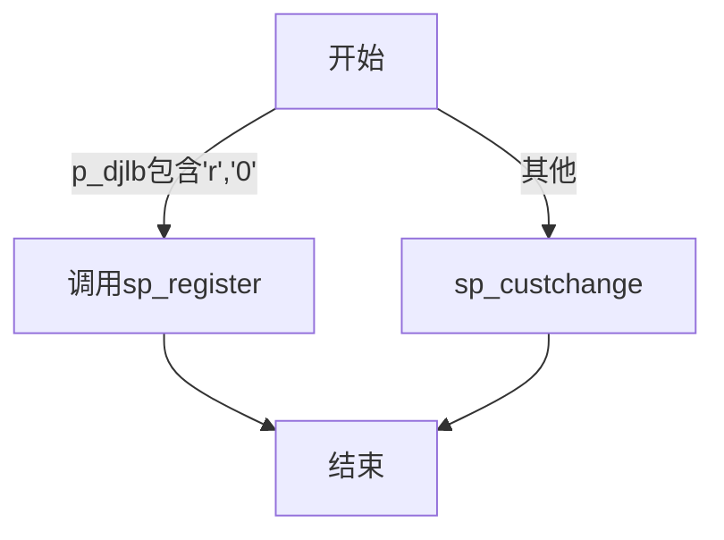


调用：[pg_addmodify_yh.sp_register](##pg_addmodify_yh.sp_register )  

​			[pg_addmodify_yh.sp_custchange](##pg_addmodify_yh.sp_custchange)

## pg_addmodify_yh.sp_yhadd	

~~~mermaid
graph TD
	开始-->初始化变量-->A1{立户工单是否有效}--有效-->根据立户工单单体逐条对变量赋值-->插入用户信息表/户表信息表/水表档案表/户表银行信息表-->结束
A1--无效-->结束
~~~


用途：立户审核（一户一表）

参数：p_djlb 单据类型	p_billno 单据流水	p_person 审核人	p_commit 是否提交


## pg_addmodify_yh.sp_yhmodify

用途：用户修改审核（一户一表）

逻辑与[pg_addmodify_yh.sp_yhadd](##pg_addmodify_yh.sp_yhadd)相同

# package pg_add_yh

## pg_add_yh.audit

--审核审核入口
  procedure audit(p_billno in varchar2,p_person in varchar2,p_djlb   in varchar2);

## pg_add_yh.sp_yhadd

  --立户审核（一户一表）
  procedure sp_yhadd(p_djlb in varchar2,p_billno in varchar2,p_person in varchar2,p_commit in varchar2);

逻辑与[pg_addmodify_yh.sp_yhadd](##pg_addmodify_yh.sp_yhadd)相同

# package pg_dszbill_01

## pg_dszbill_01.createhd

用途：创建呆死账单头

```
procedure createhd(p_dshno in varchar2, p_dshlb in varchar2, p_dshsmfid in varchar2, p_dshdept in varchar2, p_dshcreper in varchar2 );
```

~~~mermaid
graph TD
开始-->初始化变量-->变量赋值-->插入呆死账单头表-->结束
~~~

## pg_dszbill_01.createdt

创建呆账死账单体

```
	procedure createdt(p_dsdno in varchar2, p_dsdrowno in varchar2, p_arid in varchar2);
```

~~~mermaid
graph TD
	开始-->初始化变量-->查询账务信息ys_zw_arlist-->变量赋值-->插入到呆账死账单体表中-->结束
~~~

## pg_dszbill_01.createdszbill

用途：构造呆死帐单据
外部调用，将应收流水号ys_zw_aarist.arid在前台插入到临时表pbparmtemp.c1中	

```
procedure createdszbill(p_dshno in varchar2, p_dshlb in varchar2, p_dshsmfid in varchar2, p_dshdept in varchar2,p_dshcreper in varchar2, p_arid in varchar2);
```

~~~mermaid
graph TD
开始-->初始化变量-->插入单头调用pg_dszbill_01.createhd-->循环应收总账明细逐条插入单体调用pg_dszbill_01.createdt-->更新应收总账明细呆死账标志-->结束
~~~

## pg_dszbill_01.cancelbill

用途：删除呆账死账单据

```
procedure cancelbill(p_billno in varchar2, p_person in varchar2, p_djlb in varchar2); 
```

~~~mermaid
graph TD
开始-->A1{判断呆死账单据是否存在}--存在-->修改应收总账信息呆死账标志-->删除呆死账单体-->删除呆死账单头-->结束
A1--不存在-->结束
~~~

​	

## pg_dszbill_01.custbillmain

```
procedure custbillmain(p_cchno in varchar2, p_per in varchar2,p_billid in varchar2,p_billtype in varchar2);
```

调用 [pg_dszbill_01.custbill](##pg_dszbill_01.custbill)


## pg_dszbill_01.custbill

用途：呆死账审核

```
procedure custbill(p_cchno in varchar2, p_per in varchar2, p_billtype in varchar2, p_commit in varchar2);
```

~~~mermaid
graph TD
开始-->A1{呆死账单头信息是否存在}-->A2{变更单是否审核}-->A3{变更单是否取消}-->更新呆死账审核信息-->A4{判断审核标志p_billtype}
A1--不存在-->结束
A2--已审核-->结束
A3--已取消-->结束
A4--p_billtype=8-->更新应收总账信息正常账变更为呆坏账-->结束
A4--p_billtype<>8-->更新应收总账信息呆死账账变更为正常账-->结束
~~~

# package pg_cbplan

​	抄表计划管理

## pg_cbplan.createcb

```
procedure createcb(p_manage_no in varchar2,p_month in varchar2,p_book_no in varchar2);
```

~~~mermaid
graph TD
classDef default font-size: 10x;
    开始-->初始化变量-->A2{判断是有抄表计划}--有-->A3{判断是否抄过表}--否-->变量赋值-->计算上次水费去年度此均量,调用pg_cbplan.getmrhis-->更新抄表库和户表信息-->结束
    A2--无-->结束
    A3--是-->结束
~~~


## pg_cbplan.getmrhis

	procedure getmrhis(p_sbid   in varchar2,
	    p_month  in varchar2,
	    o_sl_1   out number,
	    o_je01_1 out number,
	    o_je02_1 out number,
	    o_je03_1 out number,
	    o_sl_2   out number,
	    o_je01_2 out number,
	    o_je02_2 out number,
	    o_je03_2 out number,
	    o_sl_3   out number,
	    o_je01_3 out number,
	    o_je02_3 out number,
	    o_je03_3 out number,
	    o_sl_4   out number,
	    o_je01_4 out number,
	    o_je02_4 out number,
	    o_je03_4 out number);
~~~mermaid
graph TD
	开始-->初始化变量-->A1{判断抄表库是否有数据}--有-->计算水量水费-->结束
	A1--否-->结束
~~~


均量（费）算法

1、前n次均量：     从最近抄表水量向历史方向递推12次抄表累计水量（0水量不计次）/递推次数
2、上次水量：      最近一次抄表水量（包括0水量）
3、去年同期水量：  去年同抄表月份的抄表水量（包括0水量）
4、去年度次均量：  去年度的抄表累计水量（0水量不计次）/递推次数
【meterread/meterreadhis】均量记录结构
mrthreesl   number(10)    前n次均量
mrthreeje01 number(13,3)  前n次均水费
mrthreeje02 number(13,3)  前n次均污水费
mrthreeje03 number(13,3)  前n次均水资源费
mrlastsl    number(10)    上次水量
mrlastje01  number(13,3)  上次水费
mrlastje02  number(13,3)  上次污水费
mrlastje03  number(13,3)  上次水资源费
mryearsl    number(10)    去年同期水量
mryearje01  number(13,3)  去年同期水费
mryearje02  number(13,3)  去年同期污水费
mryearje03  number(13,3)  去年同期水资源费
mrlastyearsl    number(10)    去年度次均量
mrlastyearje01  number(13,3)  去年度次均水费
mrlastyearje02  number(13,3)  去年度次均污水费
mrlastyearje03  number(13,3)  去年度次均水资源费

# package pg_cb_cost

## pg_cb_cost.costbatch

	procedure costbatch(p_bfid in varchar2);
		--提供外部批量调用
		--参数p_bfid 示例：表册编码1,营销公司编码1|表册编码2,营销公司编码2|表册编码3,营销公司编码3|。。。

## 	pg_cb_cost.costculate

```
procedure costculate(p_mrid in ys_cb_mtread.id%type, p_commit in number); 
```

​		用途：计划内算费

~~~mermaid
graph TD
开始-->变量初始化-->A1{是否抄表}--已抄表-->A2{水表记录是否有效}--有效-->A3{最低算费水量总表截量判断}
A1--未抄表-->结束
A2--无效-->结束
A3--本期水量小于最低算费水量-->A4{判断是否已计费是否调试}
A3--总表截量=Y-->调用单笔算费核心costculatecore-->更新水表信息-->A4{是否已计费是否调试}--非调试已计费-->更新抄表信息-->A5{是否提交}
A3--其他-->调用单笔算费核心costculatecore
A4--其他-->更新抄表信息带计费状态-->A5{是否提交}
A5--调试\不提交-->结束
A5--提交-->提交-->结束
~~~

## pg_cb_cost.costculatecore

```
procedure costculatecore(mr in out ys_cb_mtread%rowtype,p_trans  in char,p_pscid  in number,p_commit in number);
```

用途：算费核心

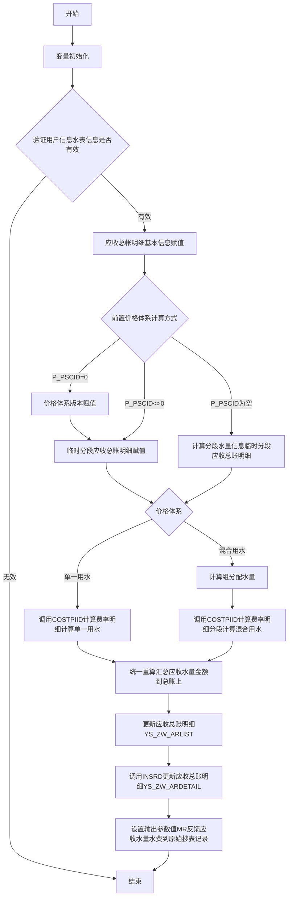

## pg_cb_cost.costpiid

	procedure costpiid(p_rl in out ys_zw_arlist%rowtype,
		     p_mr       in out ys_cb_mtread%rowtype,
		     p_sl       in number,
		     pd         in bas_price_detail%rowtype,
		     pmd        in ys_yh_pricegroup%rowtype,
		     rdtab      in out rd_table,
		     p_classctl in char,
		     p_pscid    in number,
		     p_commit   in number);
用途：费率明细计算

--p_classctl（y：强制不使用阶梯计费方法；n：计算阶梯，如果是的话）

```mermaid
graph TD
开始-->参数初始化-->费率计算标志处理-->计费时段月数计算-->基础信息更新-->A1{水费计算方法}
A1--固定单价-->金额=单价*水量-->结束
A1--固定金额-->金额=固定金额*计费月数-->结束
A1--月阶梯-->调用coststep_mon-->结束
A1--年阶梯-->调用coststep_year-->结束
```


## pg_cb_cost.coststep_mon

```
procedure coststep_mon(p_rl in out ys_zw_arlist%rowtype,
		 p_mr       in out ys_cb_mtread%rowtype,
		 p_sl       in number,
		 p_adjsl    in number,
		 p_adjdj    in number,
		 pd         in bas_price_detail%rowtype,
		 rdtab      in out rd_table,
		 p_classctl in char,
		 pmd        in ys_yh_pricegroup%rowtype);
```

​	--rd.rdpiid；rd.rdpfid；rd.rdpscid为必要参数

```mermaid
graph TD
开始-->变量初始化-->基础信息赋值-->判断数据是否满足收取阶梯的条件-->计算间隔月-->阶梯金额=阶梯单价*水量+单价*超默认人数*户增水量-->结束
```


## pg_cb_cost.coststep_year

		procedure coststep_year(p_rl in out ys_zw_arlist%rowtype,
			  p_sl       in number,
			  p_adjsl    in number,
			  p_adjdj    in number,
			  pd         in bas_price_detail%rowtype,
			  rdtab      in out rd_table,
			  p_classctl in char,
			  pmd        ys_yh_pricegroup%rowtype,
			  pmonth     in varchar2);

逻辑与[pg_cb_cost.coststep_mon](##pg_cb_cost.coststep_mon)相同

```mermaid
graph TD
开始-->变量初始化-->基础信息赋值-->判断数据是否满足收取阶梯的条件-->计算年累计水量-->阶梯金额=阶梯单价*水量+单价*超默认人数*户增水量-->结束
```

## pg_cb_cost.insrd

	procedure insrd(rd in rd_table, p_commit in number);
将rd插入到ys_zw_ardetail

## pg_cb_cost.getmin

```
function getmin(n1 in number, n2 in number) return number; 
	if nvl(n1, 0) <= nvl(n2, 0) then return nvl(n1, 0); else return nvl(n2, 0);end if;
```

## pg_cb_cost.getmax

```
function getmax(n1 in number, n2 in number) return number;
	if nvl(n1, 0) >= nvl(n2, 0) then return nvl(n1, 0); else return nvl(n2, 0);end if;
```

## pg_cb_cost.fboundpara

​		返回字符串中“|”的数量

	function fboundpara(p_parastr in clob) return integer is
	--一维数组规则：#####,####,####|
	--二维数组规则：#####,####,####|#####,####,#######|##,####,####|
	i     integer;
	n     integer := 0;
	vchar nchar(1);
	begin
	for i in 1 .. length(p_parastr) loop
		vchar := substr(p_parastr, i, 1);
		if vchar = '|' then n := n + 1; end if;
	end loop;
	return n;
## pg_cb_cost.fgetpara

​	返回字符串中指定元素位置的值

# package pg_paid


## pg_paid.obtwyj

```
function obtwyj(p_sdate in date, p_edate in date, p_je in number) return number;
	v_result := p_je * (trunc(p_edate) - trunc(p_sdate) + 1) * 0.003;
```

## pg_paid.obtwyjadj

		--违约金计算
		function obtwyjadj(p_arid     in varchar2, --应收流水
			     p_ardpiids in varchar2, --应收明细费项串'01|02|03'
			     p_edate    in date --终算日'不计入'违约日,参数格式'yyyy-mm-dd'
			     ) return number is
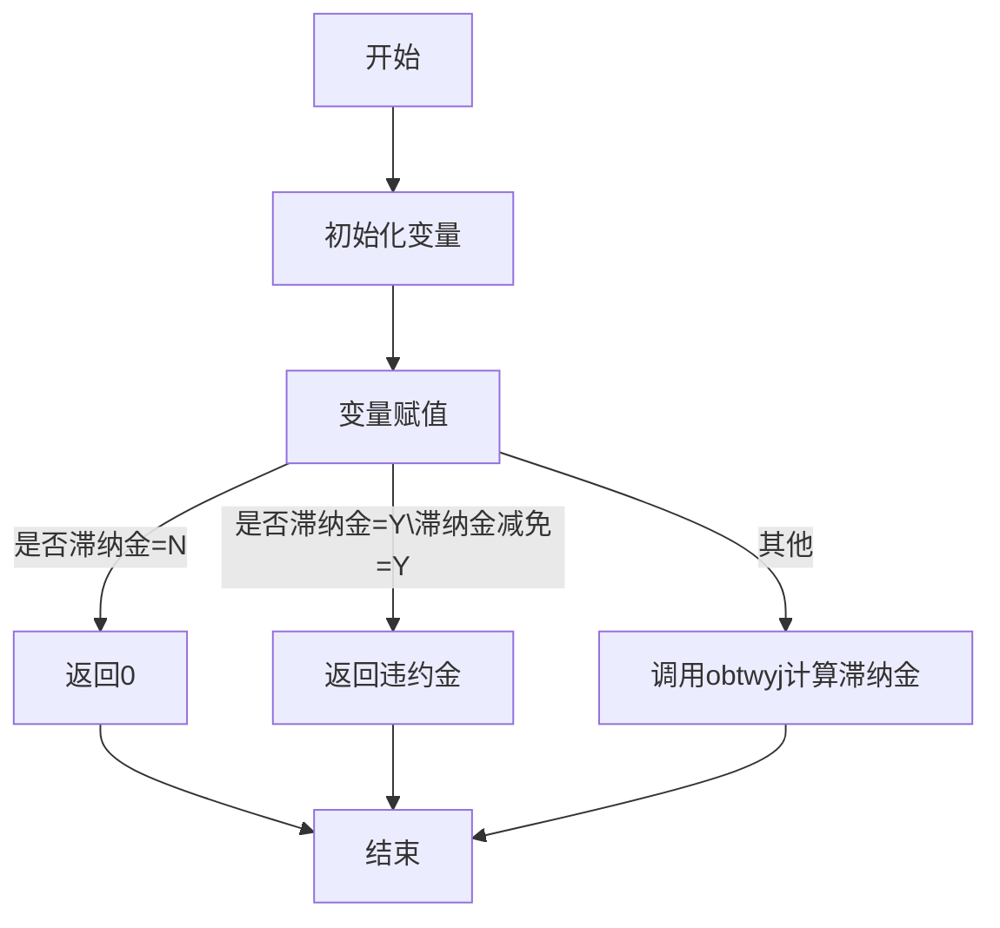


## pg_paid.poscustforys

```
procedure poscustforys(p_sbid     in varchar2,
	 p_arstr    in varchar2,
	 p_position in varchar2,
	 p_oper     in varchar2,
	 p_paypoint in varchar2,
	 p_payway   in varchar2,
	 p_payment  in number,
	 p_batch    in varchar2,
	 p_pid      out varchar2);
```

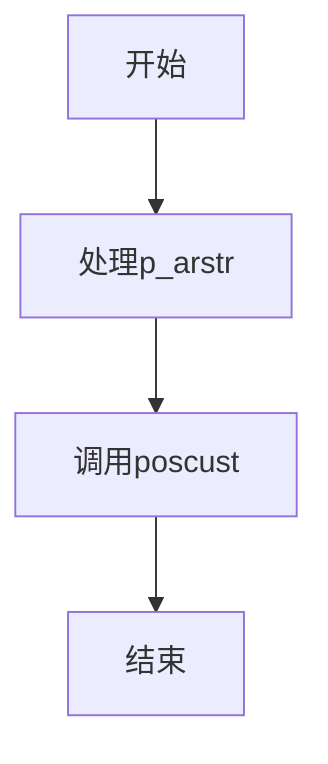


--处理p_arstr
--水司柜台缴费（一表）,参数简化版
--'123456789,Y*01!Y*02!Y*03!,0.10,0,0,0|123456789,Y*01!Y*02!Y*03!,0.10,0,0,0|'
	

​	调用[pg_paid.poscust](##pg_paid.poscust)

```
poscust(p_sbid,
	    v_parm_ars,
	    p_position,
	    p_oper,
	    p_paypoint,
	    p_payway,
	    p_payment,
	    p_batch,
	    p_pid);
```

## pg_paid.poscust

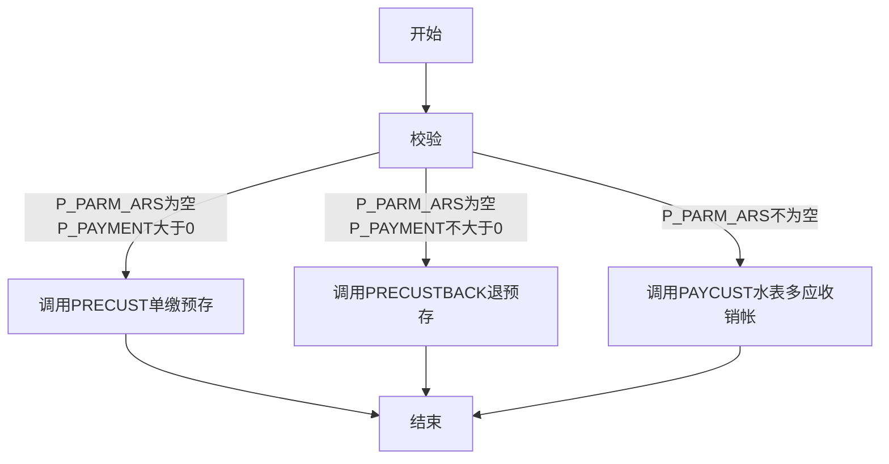


```
procedure poscust(p_sbid in varchar2,
	p_parm_ars in parm_payar_tab,
	p_position in varchar2,
	p_oper     in varchar2,
	p_paypoint in varchar2,
	p_payway   in varchar2,
	p_payment  in number,
	p_batch    in varchar2,
	p_pid      out varchar2) is
	
```


```
水司柜台缴费（一表）
【输入参数说明】：
p_sbid		in varchar2 :单一水表编号
p_parm_ars	in out parm_payr_tab :单表待销应收包成员参数如下：
	arid  in number :应收流水（依此成员次序销帐）
	ardpiids in varchar2 :费用项目串（待销费用项目,由前台勾选否(Y/N)+费项ID组成的二维数组（基于PG_CB_COST.FGETPARA二维数组规范），例如：Y,01|Y,02|N,03|,次序很重要）
	arznj in number :传入的违约金（本过程内不计算不校验），传多少销多少
	fee1 in number  :其他非系统费项1
p_position      in varchar2 :缴费单位，营销架构中营业所编码，实收计帐单位
p_oper		in varchar2 :销帐员，柜台缴费时销帐人员与收款员统一
p_payway	in varchar2 :付款方式，每交易有且仅有一种付款方式
p_payment	in number   :实收，即为（付款-找零），付款与找零在前台计算和校验
```

## pg_paid.paycust

一水表多应收销帐

	procedure paycust(p_sbid        in varchar2,
		    p_parm_ars    in parm_payar_tab,
		    p_trans       in varchar2,
		    p_position    in varchar2,
		    p_paypoint    in varchar2,
		    p_bdate       in date,
		    p_bseqno      in varchar2,
		    p_oper        in varchar2,
		    p_payway      in varchar2,
		    p_payment     in number,
		    p_pid_source  in varchar2,
		    p_commit      in number,
		    p_ctl_msg     in number,
		    p_ctl_pre     in number,
		    p_batch       in out varchar2,
		    p_seqno       in out varchar2,
		    p_pid         out varchar2,
		    o_remainafter out number);
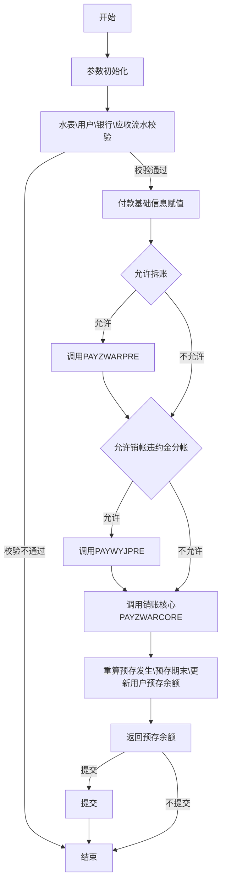


## pg_paid.payzwarpre

```
procedure payzwarpre(p_parm_ars in out parm_payar_tab, p_commit in number default 不提交); 
```

部分费用项目销帐前拆分应收（一应收帐）

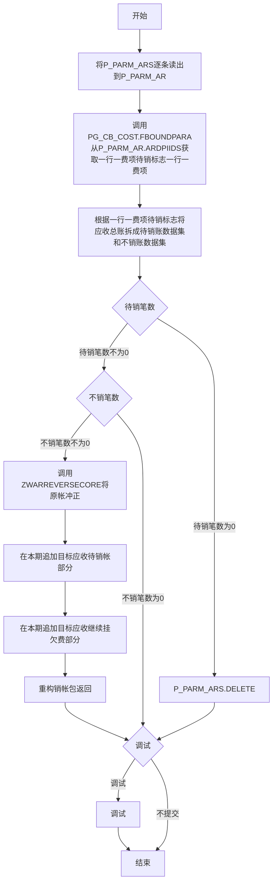

## pg_paid.zwarreversecore

应收冲正核心

	procedure zwarreversecore(p_arid_source         in varchar2,
		    p_artrans_reverse     in varchar2,
		    p_pbatch_reverse      in varchar2,
		    p_pid_reverse         in varchar2,
		    p_ppayment_reverse    in number,
		    p_memo                in varchar2,
		    p_ctl_mircode         in varchar2,
		    p_commit              in number default 不提交,
		    o_arid_reverse        out varchar2,
		    o_artrans_reverse     out varchar2,
		    o_arje_reverse        out number,
		    o_arznj_reverse       out number,
		    o_arsxf_reverse       out number,
		    o_arsavingbq_reverse  out number,
		    io_arsavingqm_reverse in out number);
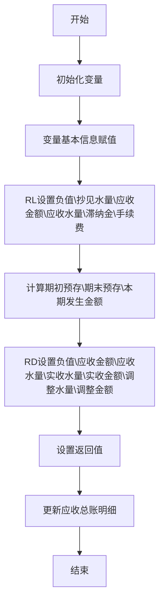

## pg_paid.paywyjpre

销帐违约金分帐销帐包预处理

```
procedure paywyjpre(p_parm_ars in out parm_payar_tab, p_commit in number default 不提交); 
```

~~~mermaid
graph TD
开始-->变量初始化-->使用PG_CB_COST.FGETPARA将P_PARM_AR.ARDPIIDS拆成费项待销标志\费项待销-->A0{费项待销标志=N\费项=ZNJ}--是-->设置参数滞纳金\滞纳金减免标志-->插入应收总账明细-->A1{提交}--提交-->提交-->结束
A0--否-->A1
A1--不提交-->结束
~~~

## pg_paid.payzwarcore

实收销帐处理核心

	procedure payzwarcore(p_pid          in varchar2,
		p_batch        in varchar2,
		p_payment      in number,
		p_remainbefore in number,
		p_paiddate     in date,
		p_paidmonth    in varchar2,
		p_parm_ars     in parm_payar_tab,
		p_commit       in number default 不提交,
		o_sum_arje     out number,
		o_sum_arznj    out number,
		o_sum_arsxf    out number);
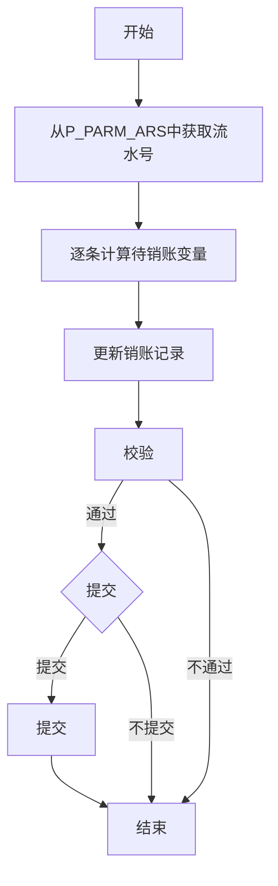


## pg_paid.precust

	procedure precust(p_sbid        in varchar2,
		    p_position    in varchar2,
		    p_oper        in varchar2,
		    p_payway      in varchar2,
		    p_payment     in number,
		    p_memo        in varchar2,
		    p_batch       in out varchar2,
		    o_pid         out varchar2,
		    o_remainafter out number);
		预存充值（一表）


## pg_paid.precustback

	procedure precustback(p_sbid        in varchar2,
		p_position    in varchar2,
		p_oper        in varchar2,
		p_payway      in varchar2,
		p_payment     in number,
		p_memo        in varchar2,
		p_batch       in out varchar2,
		o_pid         out varchar2,
		o_remainafter out number);
		预存退费（一表）
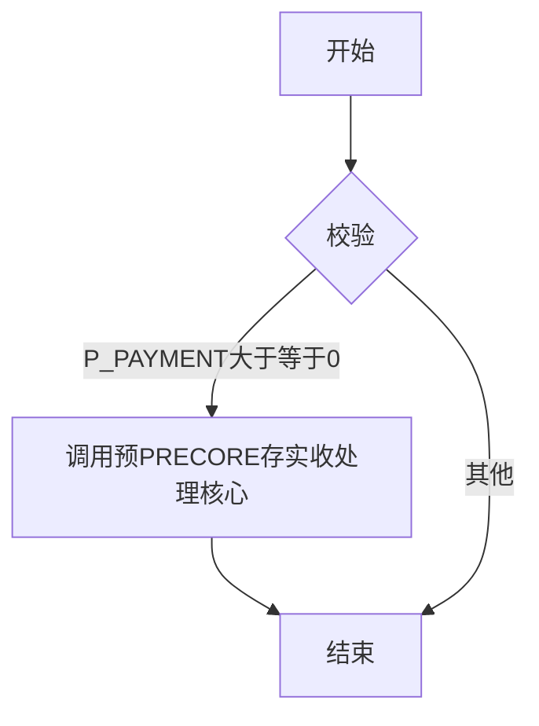

## pg_paid.precore

	procedure precore(p_sbid        in varchar2,
		    p_trans       in varchar2,
		    p_position    in varchar2,
		    p_paypoint    in varchar2,
		    p_bdate       in date,
		    p_bseqno      in varchar2,
		    p_oper        in varchar2,
		    p_payway      in varchar2,
		    p_payment     in number,
		    p_commit      in number,
		    p_memo        in varchar2,
		    p_batch       in out varchar2,
		    p_seqno       in out varchar2,
		    o_pid         out varchar2,
		    o_remainafter out number);
		预存实收处理核心
		【输入参数说明】：
		p_sbid        in varchar2：指定预存发生的水表编号
		p_trans      in varchar2：指定预存发生计帐实收事务
		p_position      in varchar2：指定预存发生缴费单位
		p_paypoint   in varchar2：指定预存发生缴费地点
		p_bdate      in date：指定预存发生银行帐务日期
		p_bseqno     in varchar2：指定预存发生银行交易流水
		p_oper       in varchar2：预存收款人
		p_payway     in varchar2：预存发生付款方式
		p_payment    in number：预存发生金额（+/-）
		p_commit     in number：是否提交
		p_memo       in varchar2：备注信息
		p_batch      in out number：可空，绑定批次
		p_seqno      in out number：可空，绑定批次流水
		【输出参数说明】：
		p_pid        out number：预存发生记录计帐成功后返回的实收流水号
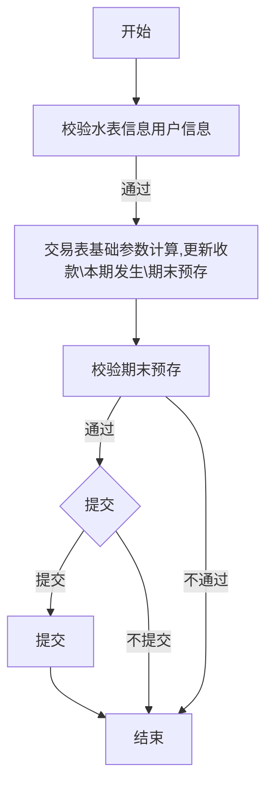


## pg_paid.fmid

	function fmid(p_str in varchar2, p_sep in varchar2) return integer;
		返回p_str中p_sep的个数+1
# package pg_balanceadj_01

## pg_balanceadj_01.approve

```
procedure approve(p_billno in varchar2,
	p_person in varchar2,
	p_billid in varchar2,
	p_djlb   in varchar2);
	--单据提交入口过程
```

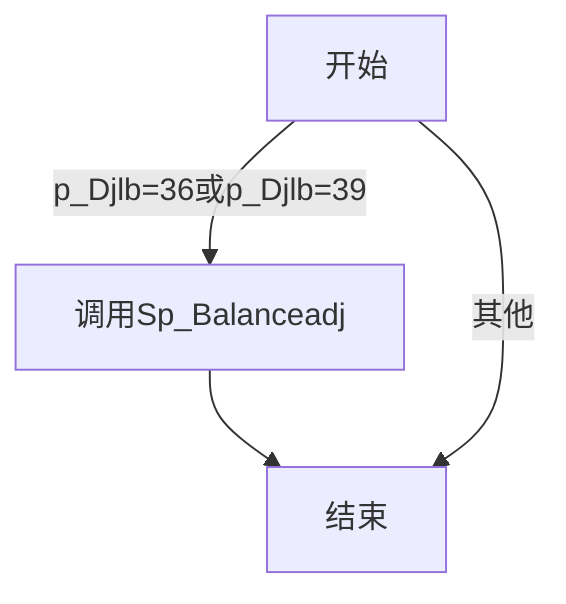

## pg_balanceadj_01.sp_balanceadj

```
--减免单体
procedure sp_balanceadj(p_bill_id in varchar2, --批次流水
	p_per     in varchar2, --操作员
	p_commit  in varchar2 --提交标志;
	);
```

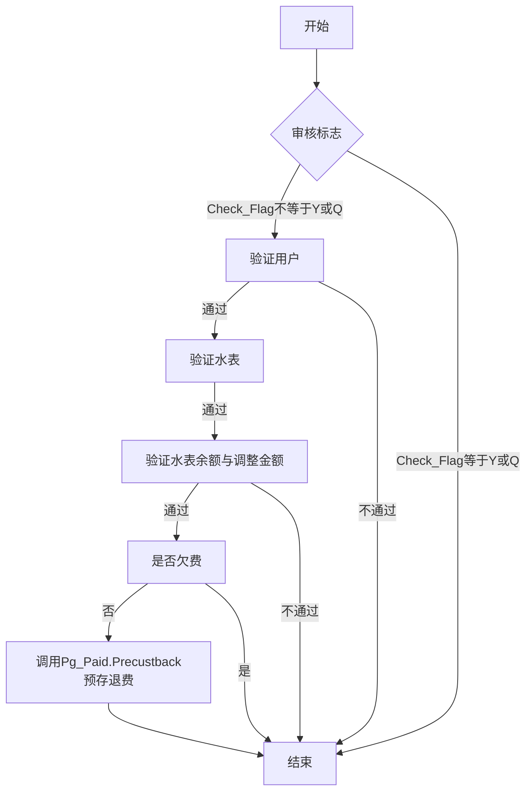

# package pg_arsplit_01

## pg_arsplit_01.approve

	--单据提交入口过程
	procedure approve(p_billno in varchar2,
		    p_person in varchar2,
		    p_billid in varchar2,
		    p_djlb   in varchar2);
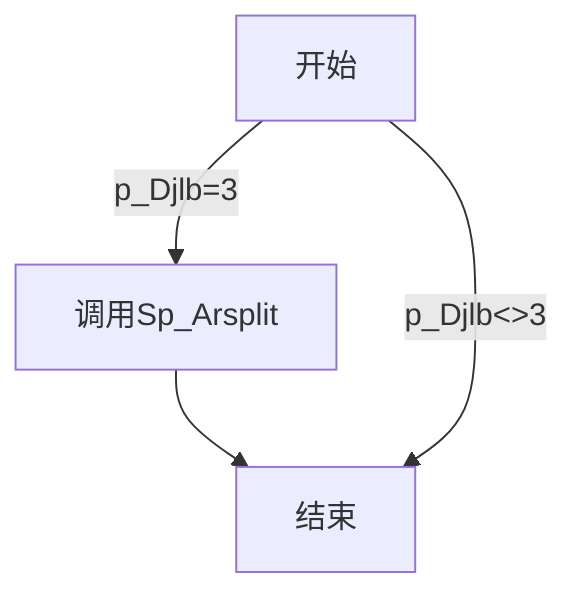

## pg_arsplit_01.sp_arsplit

	--拆分账单单体
	procedure sp_arsplit(p_bill_id in varchar2, --批次流水
		       p_per     in varchar2, --操作员
		       p_commit  in varchar2 --提交标志;
		       );
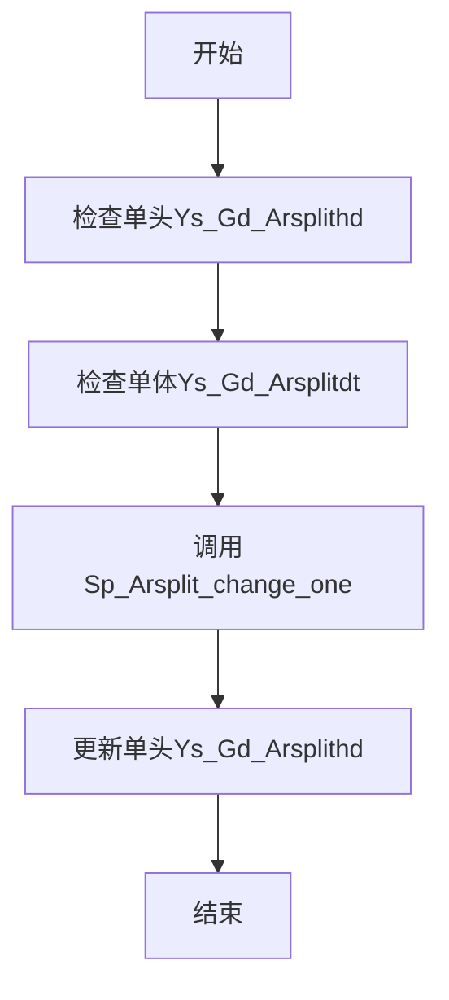

## pg_arsplit_01.sp_arsplit_change_one

	--拆分账单单体
	procedure sp_arsplit_change_one(p_arsplitdt   in ys_gd_arsplitdt%rowtype,  
		       p_per     in varchar2, --操作员
		       p_commit  in varchar2 --提交标志;
		       ); 
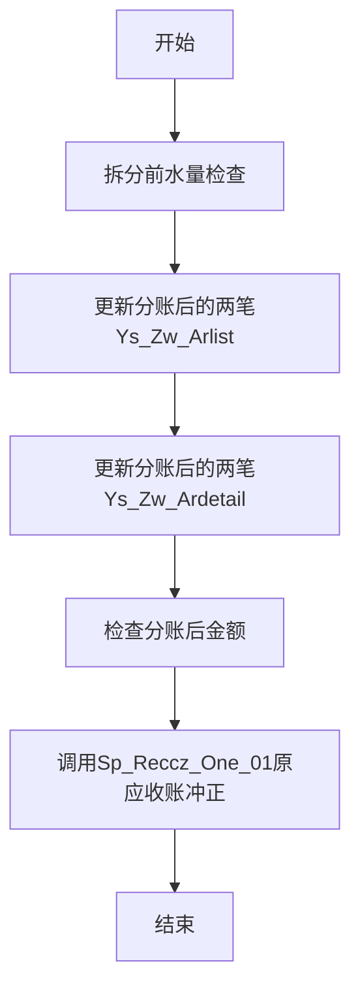

## pg_arsplit_01.sp_reccz_one_01

	--插入单负应收与应收冲正  --单条                     
	procedure sp_reccz_one_01(p_arid   in ys_zw_arlist.arid%type, -- 行变量
			    p_commit in varchar --是否提交标志
			    );
```mermaid
graph TD
开始-->变量赋值-->插入Ys_Zw_Ardetail负值并更新冲正标志-->插入Ys_Zw_Arlist负值并更新冲正标志--ARTRANS<>3-->更新水表信息Ys_Yh_Sbinfo-->结束
插入Ys_Zw_Arlist负值并更新冲正标志--ARTRANS=3-->结束
```


